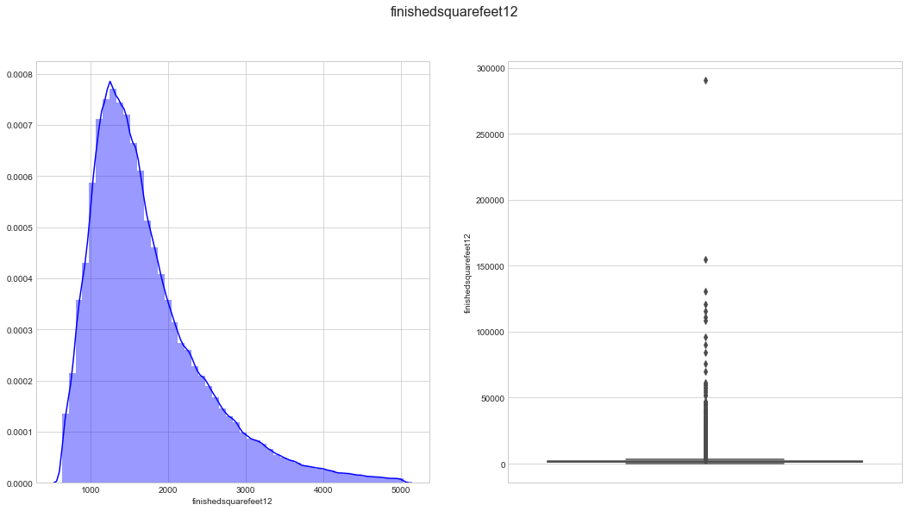
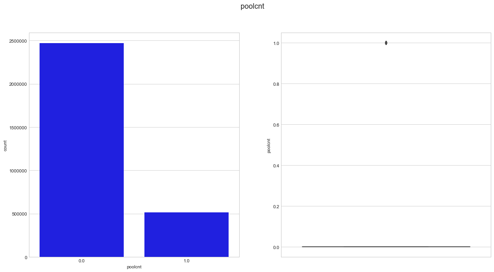
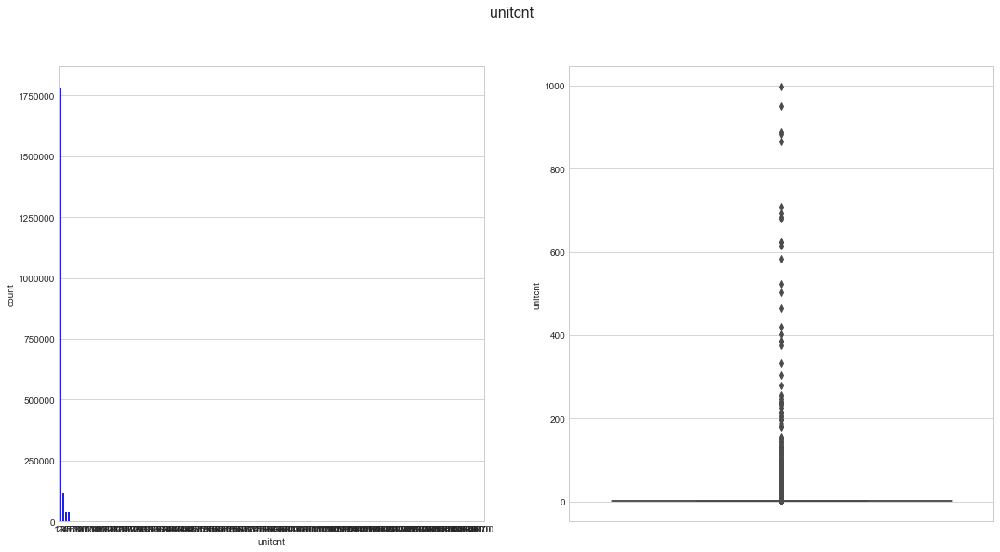
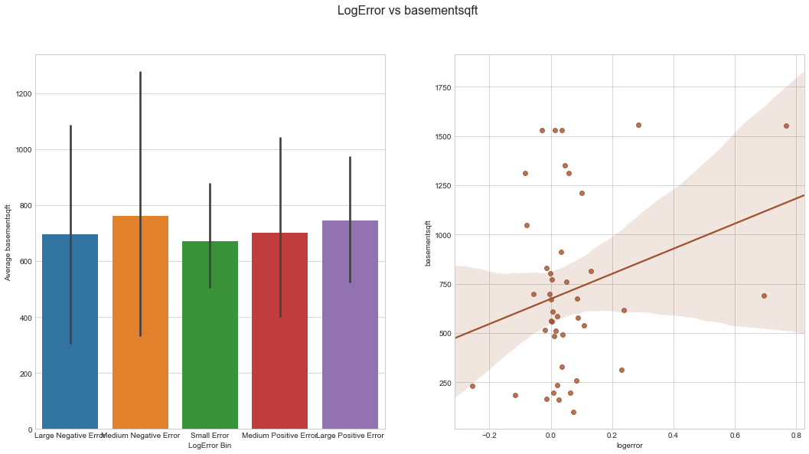
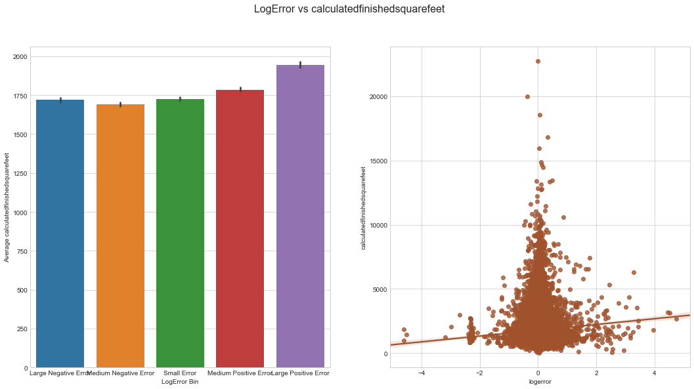
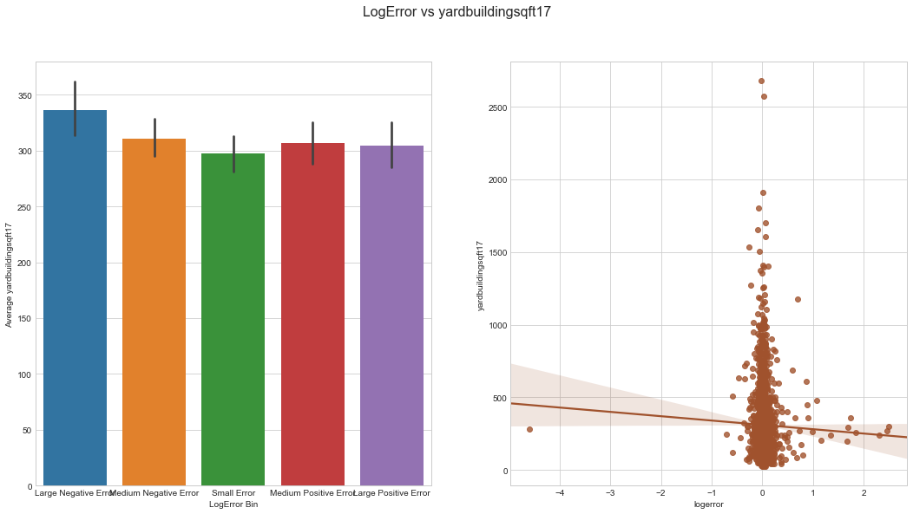
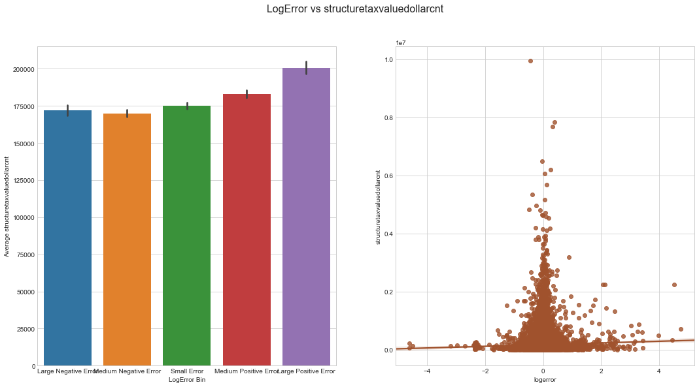
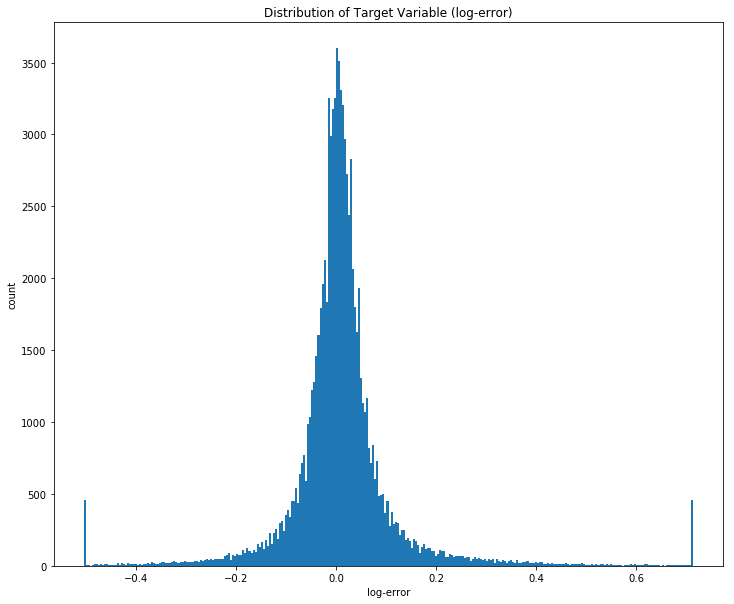

    This report was generated on 2017-10-05 at 23:08:21

# Zillow Prize Data Analysis Project

This Python 3 environment comes with many helpful analytics libraries installed
It is defined by the kaggle/python docker image: https://github.com/kaggle/docker-python (a modified version of this docker image will be made available as part of my project to ensure reproducibility).
For example, here's several helpful packages to load in 

Import Libraries and Data:

Input data files are available in the "../input/" directory.

Any results I write to the current directory are saved as output.

<table border="1" class="dataframe">
  <thead>
    <tr style="text-align: right;">
      <th></th>
      <th>parcelid</th>
      <th>airconditioningtypeid</th>
      <th>architecturalstyletypeid</th>
      <th>basementsqft</th>
      <th>bathroomcnt</th>
      <th>bedroomcnt</th>
      <th>buildingclasstypeid</th>
      <th>buildingqualitytypeid</th>
      <th>calculatedbathnbr</th>
      <th>decktypeid</th>
      <th>...</th>
      <th>numberofstories</th>
      <th>fireplaceflag</th>
      <th>structuretaxvaluedollarcnt</th>
      <th>taxvaluedollarcnt</th>
      <th>assessmentyear</th>
      <th>landtaxvaluedollarcnt</th>
      <th>taxamount</th>
      <th>taxdelinquencyflag</th>
      <th>taxdelinquencyyear</th>
      <th>censustractandblock</th>
    </tr>
  </thead>
  <tbody>
    <tr>
      <th>0</th>
      <td>10754147</td>
      <td>NaN</td>
      <td>NaN</td>
      <td>NaN</td>
      <td>0.0</td>
      <td>0.0</td>
      <td>NaN</td>
      <td>NaN</td>
      <td>NaN</td>
      <td>NaN</td>
      <td>...</td>
      <td>NaN</td>
      <td>NaN</td>
      <td>NaN</td>
      <td>9.0</td>
      <td>2015.0</td>
      <td>9.0</td>
      <td>NaN</td>
      <td>NaN</td>
      <td>NaN</td>
      <td>NaN</td>
    </tr>
    <tr>
      <th>1</th>
      <td>10759547</td>
      <td>NaN</td>
      <td>NaN</td>
      <td>NaN</td>
      <td>0.0</td>
      <td>0.0</td>
      <td>NaN</td>
      <td>NaN</td>
      <td>NaN</td>
      <td>NaN</td>
      <td>...</td>
      <td>NaN</td>
      <td>NaN</td>
      <td>NaN</td>
      <td>27516.0</td>
      <td>2015.0</td>
      <td>27516.0</td>
      <td>NaN</td>
      <td>NaN</td>
      <td>NaN</td>
      <td>NaN</td>
    </tr>
    <tr>
      <th>2</th>
      <td>10843547</td>
      <td>NaN</td>
      <td>NaN</td>
      <td>NaN</td>
      <td>0.0</td>
      <td>0.0</td>
      <td>NaN</td>
      <td>NaN</td>
      <td>NaN</td>
      <td>NaN</td>
      <td>...</td>
      <td>NaN</td>
      <td>NaN</td>
      <td>650756.0</td>
      <td>1413387.0</td>
      <td>2015.0</td>
      <td>762631.0</td>
      <td>20800.37</td>
      <td>NaN</td>
      <td>NaN</td>
      <td>NaN</td>
    </tr>
    <tr>
      <th>3</th>
      <td>10859147</td>
      <td>NaN</td>
      <td>NaN</td>
      <td>NaN</td>
      <td>0.0</td>
      <td>0.0</td>
      <td>3</td>
      <td>7</td>
      <td>NaN</td>
      <td>NaN</td>
      <td>...</td>
      <td>1.0</td>
      <td>NaN</td>
      <td>571346.0</td>
      <td>1156834.0</td>
      <td>2015.0</td>
      <td>585488.0</td>
      <td>14557.57</td>
      <td>NaN</td>
      <td>NaN</td>
      <td>NaN</td>
    </tr>
    <tr>
      <th>4</th>
      <td>10879947</td>
      <td>NaN</td>
      <td>NaN</td>
      <td>NaN</td>
      <td>0.0</td>
      <td>0.0</td>
      <td>4</td>
      <td>NaN</td>
      <td>NaN</td>
      <td>NaN</td>
      <td>...</td>
      <td>NaN</td>
      <td>NaN</td>
      <td>193796.0</td>
      <td>433491.0</td>
      <td>2015.0</td>
      <td>239695.0</td>
      <td>5725.17</td>
      <td>NaN</td>
      <td>NaN</td>
      <td>NaN</td>
    </tr>
  </tbody>
</table>

5 rows × 58 columns

<table border="1" class="dataframe">
  <thead>
    <tr style="text-align: right;">
      <th></th>
      <th>parcelid</th>
      <th>logerror</th>
      <th>transactiondate</th>
    </tr>
  </thead>
  <tbody>
    <tr>
      <th>0</th>
      <td>11016594</td>
      <td>0.0276</td>
      <td>2016-01-01</td>
    </tr>
    <tr>
      <th>1</th>
      <td>14366692</td>
      <td>-0.1684</td>
      <td>2016-01-01</td>
    </tr>
    <tr>
      <th>2</th>
      <td>12098116</td>
      <td>-0.0040</td>
      <td>2016-01-01</td>
    </tr>
    <tr>
      <th>3</th>
      <td>12643413</td>
      <td>0.0218</td>
      <td>2016-01-02</td>
    </tr>
    <tr>
      <th>4</th>
      <td>14432541</td>
      <td>-0.0050</td>
      <td>2016-01-02</td>
    </tr>
  </tbody>
</table>

<table border="1" class="dataframe">
  <thead>
    <tr style="text-align: right;">
      <th></th>
      <th>parcelid</th>
      <th>airconditioningtypeid</th>
      <th>architecturalstyletypeid</th>
      <th>basementsqft</th>
      <th>bathroomcnt</th>
      <th>bedroomcnt</th>
      <th>buildingclasstypeid</th>
      <th>buildingqualitytypeid</th>
      <th>calculatedbathnbr</th>
      <th>decktypeid</th>
      <th>...</th>
      <th>structuretaxvaluedollarcnt</th>
      <th>taxvaluedollarcnt</th>
      <th>assessmentyear</th>
      <th>landtaxvaluedollarcnt</th>
      <th>taxamount</th>
      <th>taxdelinquencyflag</th>
      <th>taxdelinquencyyear</th>
      <th>censustractandblock</th>
      <th>logerror</th>
      <th>transactiondate</th>
    </tr>
  </thead>
  <tbody>
    <tr>
      <th>0</th>
      <td>17073783</td>
      <td>NaN</td>
      <td>NaN</td>
      <td>NaN</td>
      <td>2.5</td>
      <td>3.0</td>
      <td>NaN</td>
      <td>NaN</td>
      <td>2.5</td>
      <td>NaN</td>
      <td>...</td>
      <td>115087.0</td>
      <td>191811.0</td>
      <td>2015.0</td>
      <td>76724.0</td>
      <td>2015.06</td>
      <td>NaN</td>
      <td>NaN</td>
      <td>61110022003007</td>
      <td>0.0953</td>
      <td>2016-01-27</td>
    </tr>
    <tr>
      <th>1</th>
      <td>17088994</td>
      <td>NaN</td>
      <td>NaN</td>
      <td>NaN</td>
      <td>1.0</td>
      <td>2.0</td>
      <td>NaN</td>
      <td>NaN</td>
      <td>1.0</td>
      <td>NaN</td>
      <td>...</td>
      <td>143809.0</td>
      <td>239679.0</td>
      <td>2015.0</td>
      <td>95870.0</td>
      <td>2581.30</td>
      <td>NaN</td>
      <td>NaN</td>
      <td>61110015031002</td>
      <td>0.0198</td>
      <td>2016-03-30</td>
    </tr>
    <tr>
      <th>2</th>
      <td>17100444</td>
      <td>NaN</td>
      <td>NaN</td>
      <td>NaN</td>
      <td>2.0</td>
      <td>3.0</td>
      <td>NaN</td>
      <td>NaN</td>
      <td>2.0</td>
      <td>NaN</td>
      <td>...</td>
      <td>33619.0</td>
      <td>47853.0</td>
      <td>2015.0</td>
      <td>14234.0</td>
      <td>591.64</td>
      <td>NaN</td>
      <td>NaN</td>
      <td>61110007011007</td>
      <td>0.0060</td>
      <td>2016-05-27</td>
    </tr>
    <tr>
      <th>3</th>
      <td>17102429</td>
      <td>NaN</td>
      <td>NaN</td>
      <td>NaN</td>
      <td>1.5</td>
      <td>2.0</td>
      <td>NaN</td>
      <td>NaN</td>
      <td>1.5</td>
      <td>NaN</td>
      <td>...</td>
      <td>45609.0</td>
      <td>62914.0</td>
      <td>2015.0</td>
      <td>17305.0</td>
      <td>682.78</td>
      <td>NaN</td>
      <td>NaN</td>
      <td>61110008002013</td>
      <td>-0.0566</td>
      <td>2016-06-07</td>
    </tr>
    <tr>
      <th>4</th>
      <td>17109604</td>
      <td>NaN</td>
      <td>NaN</td>
      <td>NaN</td>
      <td>2.5</td>
      <td>4.0</td>
      <td>NaN</td>
      <td>NaN</td>
      <td>2.5</td>
      <td>NaN</td>
      <td>...</td>
      <td>277000.0</td>
      <td>554000.0</td>
      <td>2015.0</td>
      <td>277000.0</td>
      <td>5886.92</td>
      <td>NaN</td>
      <td>NaN</td>
      <td>61110014021007</td>
      <td>0.0573</td>
      <td>2016-08-08</td>
    </tr>
  </tbody>
</table>

5 rows × 60 columns

    Large Negative Error     18442
    Small Error              18432
    Medium Negative Error    17973
    Large Positive Error     17947
    Medium Positive Error    17481
    Name: logerror_bin, dtype: int64

## Supplemental figures

    (90275, 3)

    ---------------------------------------------------------------------------

    ValueError                                Traceback (most recent call last)

    <ipython-input-28-a12ee0bf513a> in <module>()
          9     'seed' : 0
         10 }
    ---> 11 dtrain = xgb.DMatrix(train_df, train_y, feature_names=train_df.columns.values)
         12 model = xgb.train(dict(xgb_params, silent=0), dtrain, num_boost_round=50)
         13 

    ~/anaconda3/lib/python3.6/site-packages/xgboost/core.py in __init__(self, data, label, missing, weight, silent, feature_names, feature_types)
        253         data, feature_names, feature_types = _maybe_pandas_data(data,
        254                                                                 feature_names,
    --> 255                                                                 feature_types)
        256         label = _maybe_pandas_label(label)
        257 

    ~/anaconda3/lib/python3.6/site-packages/xgboost/core.py in _maybe_pandas_data(data, feature_names, feature_types)
        179         msg = """DataFrame.dtypes for data must be int, float or bool.
        180 Did not expect the data types in fields """
    --> 181         raise ValueError(msg + ', '.join(bad_fields))
        182 
        183     if feature_names is None:

    ValueError: DataFrame.dtypes for data must be int, float or bool.
    Did not expect the data types in fields transactiondate

Distribution of Target Variable:

Log-errors are close to normally distributed around a 0 mean, but with a slightly positive skew. There are also a considerable number of outliers, I will explore whether removing these improves model performance.

Proportion of Missing Values in Each Column:

    /Users/marskar/anaconda3/lib/python3.6/site-packages/IPython/core/interactiveshell.py:2728: DtypeWarning: Columns (22,32,34,49,55) have mixed types. Specify dtype option on import or set low_memory=False.
      interactivity=interactivity, compiler=compiler, result=result)

       parcelid  airconditioningtypeid  architecturalstyletypeid  basementsqft  \
    0  10754147                    NaN                       NaN           NaN   
    1  10759547                    NaN                       NaN           NaN   
    2  10843547                    NaN                       NaN           NaN   
    3  10859147                    NaN                       NaN           NaN   
    4  10879947                    NaN                       NaN           NaN   
    
       bathroomcnt  bedroomcnt  buildingclasstypeid  buildingqualitytypeid  \
    0          0.0         0.0                  NaN                    NaN   
    1          0.0         0.0                  NaN                    NaN   
    2          0.0         0.0                  NaN                    NaN   
    3          0.0         0.0                  3.0                    7.0   
    4          0.0         0.0                  4.0                    NaN   
    
       calculatedbathnbr  decktypeid         ...           numberofstories  \
    0                NaN         NaN         ...                       NaN   
    1                NaN         NaN         ...                       NaN   
    2                NaN         NaN         ...                       NaN   
    3                NaN         NaN         ...                       1.0   
    4                NaN         NaN         ...                       NaN   
    
       fireplaceflag  structuretaxvaluedollarcnt  taxvaluedollarcnt  \
    0            NaN                         NaN                9.0   
    1            NaN                         NaN            27516.0   
    2            NaN                    650756.0          1413387.0   
    3            NaN                    571346.0          1156834.0   
    4            NaN                    193796.0           433491.0   
    
       assessmentyear  landtaxvaluedollarcnt  taxamount  taxdelinquencyflag  \
    0          2015.0                    9.0        NaN                 NaN   
    1          2015.0                27516.0        NaN                 NaN   
    2          2015.0               762631.0   20800.37                 NaN   
    3          2015.0               585488.0   14557.57                 NaN   
    4          2015.0               239695.0    5725.17                 NaN   
    
       taxdelinquencyyear  censustractandblock  
    0                 NaN                  NaN  
    1                 NaN                  NaN  
    2                 NaN                  NaN  
    3                 NaN                  NaN  
    4                 NaN                  NaN  
    
    [5 rows x 58 columns]
    ---------------------
    (2985217, 58)

# Analyse the Dimensions of our Datasets

    Training Size:(90275, 61)
    Property Size:(2985217, 58)

    parcelid                              0
    airconditioningtypeid           2173698
    architecturalstyletypeid        2979156
    basementsqft                    2983589
    bathroomcnt                       11462
    bedroomcnt                        11450
    buildingclasstypeid             2972588
    buildingqualitytypeid           1046729
    calculatedbathnbr                128912
    decktypeid                      2968121
    finishedfloor1squarefeet        2782500
    calculatedfinishedsquarefeet      55565
    finishedsquarefeet12             276033
    finishedsquarefeet13            2977545
    finishedsquarefeet15            2794419
    finishedsquarefeet50            2782500
    finishedsquarefeet6             2963216
    fips                              11437
    fireplacecnt                    2672580
    fullbathcnt                      128912
    garagecarcnt                    2101950
    garagetotalsqft                 2101950
    hashottuborspa                  2916203
    heatingorsystemtypeid           1178816
    latitude                          11437
    longitude                         11437
    lotsizesquarefeet                276099
    poolcnt                         2467683
    poolsizesum                     2957257
    pooltypeid10                    2948278
    pooltypeid2                     2953142
    pooltypeid7                     2499758
    propertycountylandusecode         12277
    propertylandusetypeid             11437
    propertyzoningdesc              1006588
    rawcensustractandblock            11437
    regionidcity                      62845
    regionidcounty                    11437
    regionidneighborhood            1828815
    regionidzip                       13980
    roomcnt                           11475
    storytypeid                     2983593
    threequarterbathnbr             2673586
    typeconstructiontypeid          2978470
    unitcnt                         1007727
    yardbuildingsqft17              2904862
    yardbuildingsqft26              2982570
    yearbuilt                         59928
    numberofstories                 2303148
    fireplaceflag                   2980054
    structuretaxvaluedollarcnt        54982
    taxvaluedollarcnt                 42550
    assessmentyear                    11439
    landtaxvaluedollarcnt             67733
    taxamount                         31250
    taxdelinquencyflag              2928755
    taxdelinquencyyear              2928753
    censustractandblock               75126
    dtype: int64

There are several columns which have a very high proportion of missing values. It may be worth analysing these more closely.

### Monthly Effects on Target Variable

          parcelid  logerror transactiondate  transaction_month
    0     11016594    0.0276      2016-01-01                  1
    4392  12379107    0.0276      2016-01-22                  1
    4391  12259947    0.0010      2016-01-22                  1
    4390  17204079    0.0871      2016-01-22                  1
    4389  12492292   -0.0212      2016-01-22                  1

For submission we are required to predict values for October, November and December. The differing distributions of the target variable over these months indicates that it may be useful to create an additional 'transaction_month' feature as shown above. Lets have a closer look at the distribution across only October, November and December.

Proportion of Transactions in Each Month

        transaction_month  month
    1            0.072623      1
    2            0.070152      2
    3            0.095840      3
    4            0.103140      4
    5            0.110341      5
    6            0.120986      6
    7            0.110186      7
    8            0.116045      8
    9            0.106065      9
    10           0.055132     10
    11           0.020227     11
    12           0.019263     12

This datase contains more transactions occuring in the Spring and Summer months, although it must be noted that some transactions from October, November and December have been removed to form the competition's test set (thanks to nonrandom for pointing this out).

Feature Importance

       parcelid  logerror transactiondate  transaction_month  \
    0  11016594    0.0276      2016-01-01                  1   
    1  12379107    0.0276      2016-01-22                  1   
    2  12259947    0.0010      2016-01-22                  1   
    3  17204079    0.0871      2016-01-22                  1   
    4  12492292   -0.0212      2016-01-22                  1   
    
       airconditioningtypeid  architecturalstyletypeid  basementsqft  bathroomcnt  \
    0                    1.0                      -1.0          -1.0          2.0   
    1                   -1.0                      -1.0          -1.0          1.0   
    2                   -1.0                      -1.0          -1.0          1.0   
    3                   -1.0                      -1.0          -1.0          4.0   
    4                    1.0                      -1.0          -1.0          1.0   
    
       bedroomcnt  buildingclasstypeid         ...           numberofstories  \
    0         3.0                 -1.0         ...                      -1.0   
    1         2.0                 -1.0         ...                      -1.0   
    2         3.0                 -1.0         ...                      -1.0   
    3         4.0                 -1.0         ...                       2.0   
    4         3.0                 -1.0         ...                      -1.0   
    
       fireplaceflag  structuretaxvaluedollarcnt  taxvaluedollarcnt  \
    0             -1                    122754.0           360170.0   
    1             -1                     37095.0           185481.0   
    2             -1                    137012.0           240371.0   
    3             -1                    373100.0           746200.0   
    4             -1                     40729.0            61709.0   
    
       assessmentyear  landtaxvaluedollarcnt  taxamount  taxdelinquencyflag  \
    0          2015.0               237416.0    6735.88                  -1   
    1          2015.0               148386.0    3051.73                  -1   
    2          2015.0               103359.0    5707.91                  -1   
    3          2015.0               373100.0    8576.10                  -1   
    4          2015.0                20980.0    1056.92                  -1   
    
       taxdelinquencyyear  censustractandblock  
    0                -1.0         6.037107e+13  
    1                -1.0         6.037532e+13  
    2                -1.0         6.037541e+13  
    3                -1.0         6.111008e+13  
    4                -1.0         6.037571e+13  
    
    [5 rows x 61 columns]
    ---------------------
    (90275, 61)

       transaction_month  airconditioningtypeid  architecturalstyletypeid  \
    0                  1                    1.0                      -1.0   
    1                  1                   -1.0                      -1.0   
    2                  1                   -1.0                      -1.0   
    3                  1                   -1.0                      -1.0   
    4                  1                    1.0                      -1.0   
    
       basementsqft  bathroomcnt  bedroomcnt  buildingclasstypeid  \
    0          -1.0          2.0         3.0                 -1.0   
    1          -1.0          1.0         2.0                 -1.0   
    2          -1.0          1.0         3.0                 -1.0   
    3          -1.0          4.0         4.0                 -1.0   
    4          -1.0          1.0         3.0                 -1.0   
    
       buildingqualitytypeid  calculatedbathnbr  decktypeid         ...           \
    0                    4.0                2.0        -1.0         ...            
    1                    7.0                1.0        -1.0         ...            
    2                    7.0                1.0        -1.0         ...            
    3                   -1.0                4.0        -1.0         ...            
    4                    7.0                1.0        -1.0         ...            
    
       numberofstories  fireplaceflag  structuretaxvaluedollarcnt  \
    0             -1.0              0                    122754.0   
    1             -1.0              0                     37095.0   
    2             -1.0              0                    137012.0   
    3              2.0              0                    373100.0   
    4             -1.0              0                     40729.0   
    
       taxvaluedollarcnt  assessmentyear  landtaxvaluedollarcnt  taxamount  \
    0           360170.0          2015.0               237416.0    6735.88   
    1           185481.0          2015.0               148386.0    3051.73   
    2           240371.0          2015.0               103359.0    5707.91   
    3           746200.0          2015.0               373100.0    8576.10   
    4            61709.0          2015.0                20980.0    1056.92   
    
       taxdelinquencyflag  taxdelinquencyyear  censustractandblock  
    0                   0                -1.0         6.037107e+13  
    1                   0                -1.0         6.037532e+13  
    2                   0                -1.0         6.037541e+13  
    3                   0                -1.0         6.111008e+13  
    4                   0                -1.0         6.037571e+13  
    
    [5 rows x 58 columns]
    ------------
    0    0.0276
    1    0.0276
    2    0.0010
    3    0.0871
    4   -0.0212
    Name: logerror, dtype: float64

                       features  importance
    0         transaction_month    0.039308
    1     airconditioningtypeid    0.006998
    2  architecturalstyletypeid    0.000359
    3              basementsqft    0.000310
    4               bathroomcnt    0.007828

    ------------
                          features  importance
    50  structuretaxvaluedollarcnt    0.083723
    25                   longitude    0.077608
    54                   taxamount    0.075427
    24                    latitude    0.074305
    26           lotsizesquarefeet    0.071182

Here we see that the greatest importance in predicting the log-error comes from features involving taxes and geographical location of the property. Notably, the 'transaction_month' feature that was engineered earlier was the 12th most important feature. 

    ---------------------------------------------------------------------------

    NameError                                 Traceback (most recent call last)

    <ipython-input-20-1e807e847848> in <module>()
    ----> 1 test= test.rename(columns={'ParcelId': 'parcelid'})
          2 #To make it easier for merging datasets on same column_id later

    NameError: name 'test' is not defined

