# Zillow Prize Data Analysis Project

    This report was last updated on 2017-10-11 at 12:04:56

<cite data-cite="5251998/SH25XT8L">(Pérez and Granger 2007)</cite>

## Introduction

This Python 3 environment comes with many helpful analytics libraries installed
It is defined by the kaggle/python docker image: https://github.com/kaggle/docker-python (a modified version of this docker image will be made available as part of my project to ensure reproducibility).
For example, here's several helpful packages to load in 

## Methods

## Results

Import Libraries and Data:

Input data files are available in the "../input/" directory.

Any results I write to the current directory are saved as output.

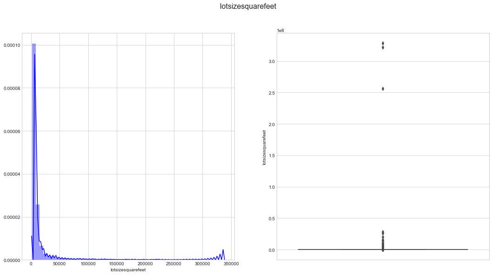

<table border="1" class="dataframe">
  <thead>
    <tr style="text-align: right;">
      <th></th>
      <th>parcelid</th>
      <th>logerror</th>
      <th>transactiondate</th>
    </tr>
  </thead>
  <tbody>
    <tr>
      <th>0</th>
      <td>11016594</td>
      <td>0.0276</td>
      <td>2016-01-01</td>
    </tr>
    <tr>
      <th>1</th>
      <td>14366692</td>
      <td>-0.1684</td>
      <td>2016-01-01</td>
    </tr>
    <tr>
      <th>2</th>
      <td>12098116</td>
      <td>-0.0040</td>
      <td>2016-01-01</td>
    </tr>
    <tr>
      <th>3</th>
      <td>12643413</td>
      <td>0.0218</td>
      <td>2016-01-02</td>
    </tr>
    <tr>
      <th>4</th>
      <td>14432541</td>
      <td>-0.0050</td>
      <td>2016-01-02</td>
    </tr>
  </tbody>
</table>

<table border="1" class="dataframe">
  <thead>
    <tr style="text-align: right;">
      <th></th>
      <th>parcelid</th>
      <th>airconditioningtypeid</th>
      <th>architecturalstyletypeid</th>
      <th>basementsqft</th>
      <th>bathroomcnt</th>
      <th>bedroomcnt</th>
      <th>buildingclasstypeid</th>
      <th>buildingqualitytypeid</th>
      <th>calculatedbathnbr</th>
      <th>decktypeid</th>
      <th>...</th>
      <th>structuretaxvaluedollarcnt</th>
      <th>taxvaluedollarcnt</th>
      <th>assessmentyear</th>
      <th>landtaxvaluedollarcnt</th>
      <th>taxamount</th>
      <th>taxdelinquencyflag</th>
      <th>taxdelinquencyyear</th>
      <th>censustractandblock</th>
      <th>logerror</th>
      <th>transactiondate</th>
    </tr>
  </thead>
  <tbody>
    <tr>
      <th>0</th>
      <td>17073783</td>
      <td>NaN</td>
      <td>NaN</td>
      <td>NaN</td>
      <td>2.5</td>
      <td>3.0</td>
      <td>NaN</td>
      <td>NaN</td>
      <td>2.5</td>
      <td>NaN</td>
      <td>...</td>
      <td>115087.0</td>
      <td>191811.0</td>
      <td>2015.0</td>
      <td>76724.0</td>
      <td>2015.06</td>
      <td>NaN</td>
      <td>NaN</td>
      <td>61110022003007</td>
      <td>0.0953</td>
      <td>2016-01-27</td>
    </tr>
    <tr>
      <th>1</th>
      <td>17088994</td>
      <td>NaN</td>
      <td>NaN</td>
      <td>NaN</td>
      <td>1.0</td>
      <td>2.0</td>
      <td>NaN</td>
      <td>NaN</td>
      <td>1.0</td>
      <td>NaN</td>
      <td>...</td>
      <td>143809.0</td>
      <td>239679.0</td>
      <td>2015.0</td>
      <td>95870.0</td>
      <td>2581.30</td>
      <td>NaN</td>
      <td>NaN</td>
      <td>61110015031002</td>
      <td>0.0198</td>
      <td>2016-03-30</td>
    </tr>
    <tr>
      <th>2</th>
      <td>17100444</td>
      <td>NaN</td>
      <td>NaN</td>
      <td>NaN</td>
      <td>2.0</td>
      <td>3.0</td>
      <td>NaN</td>
      <td>NaN</td>
      <td>2.0</td>
      <td>NaN</td>
      <td>...</td>
      <td>33619.0</td>
      <td>47853.0</td>
      <td>2015.0</td>
      <td>14234.0</td>
      <td>591.64</td>
      <td>NaN</td>
      <td>NaN</td>
      <td>61110007011007</td>
      <td>0.0060</td>
      <td>2016-05-27</td>
    </tr>
    <tr>
      <th>3</th>
      <td>17102429</td>
      <td>NaN</td>
      <td>NaN</td>
      <td>NaN</td>
      <td>1.5</td>
      <td>2.0</td>
      <td>NaN</td>
      <td>NaN</td>
      <td>1.5</td>
      <td>NaN</td>
      <td>...</td>
      <td>45609.0</td>
      <td>62914.0</td>
      <td>2015.0</td>
      <td>17305.0</td>
      <td>682.78</td>
      <td>NaN</td>
      <td>NaN</td>
      <td>61110008002013</td>
      <td>-0.0566</td>
      <td>2016-06-07</td>
    </tr>
    <tr>
      <th>4</th>
      <td>17109604</td>
      <td>NaN</td>
      <td>NaN</td>
      <td>NaN</td>
      <td>2.5</td>
      <td>4.0</td>
      <td>NaN</td>
      <td>NaN</td>
      <td>2.5</td>
      <td>NaN</td>
      <td>...</td>
      <td>277000.0</td>
      <td>554000.0</td>
      <td>2015.0</td>
      <td>277000.0</td>
      <td>5886.92</td>
      <td>NaN</td>
      <td>NaN</td>
      <td>61110014021007</td>
      <td>0.0573</td>
      <td>2016-08-08</td>
    </tr>
  </tbody>
</table>

5 rows × 60 columns

    Large Negative Error     18442
    Small Error              18432
    Medium Negative Error    17973
    Large Positive Error     17947
    Medium Positive Error    17481
    Name: logerror_bin, dtype: int64

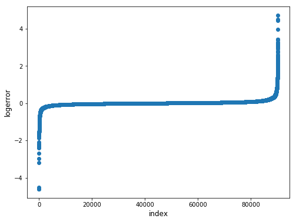

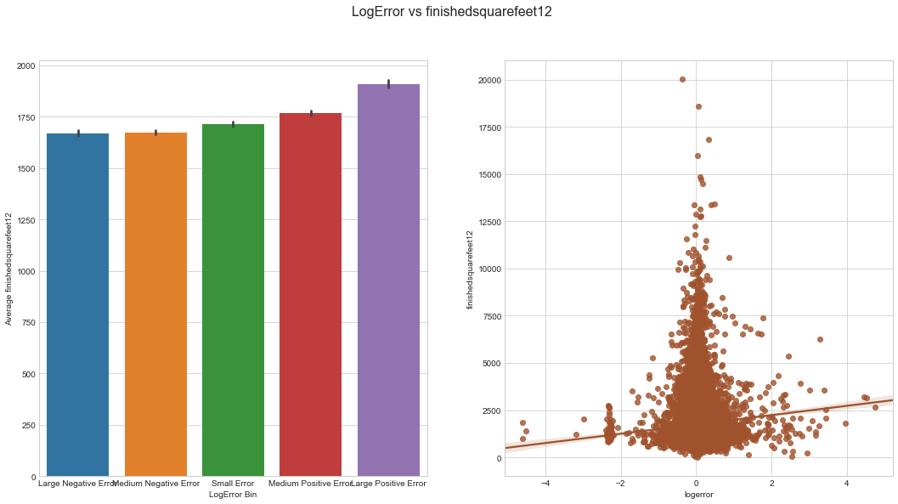

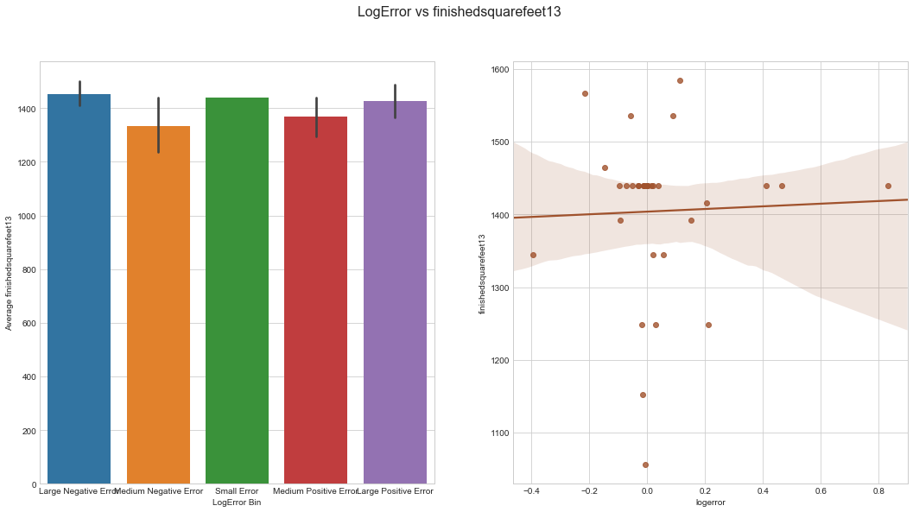

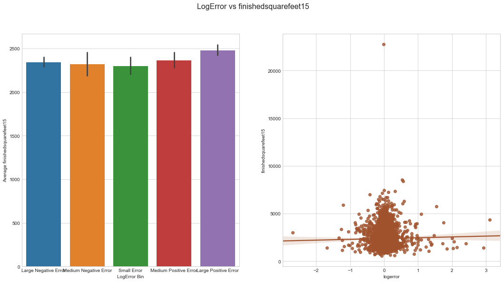

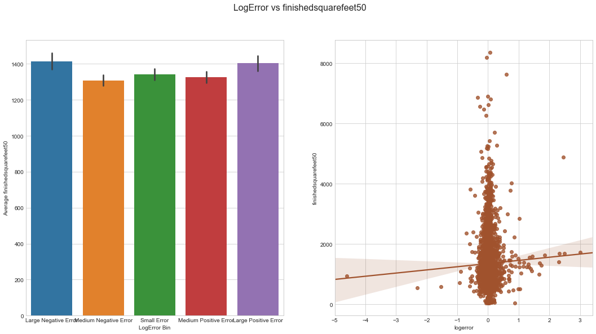

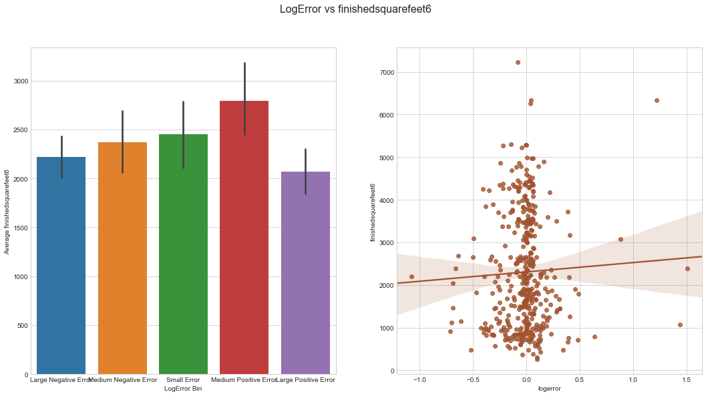

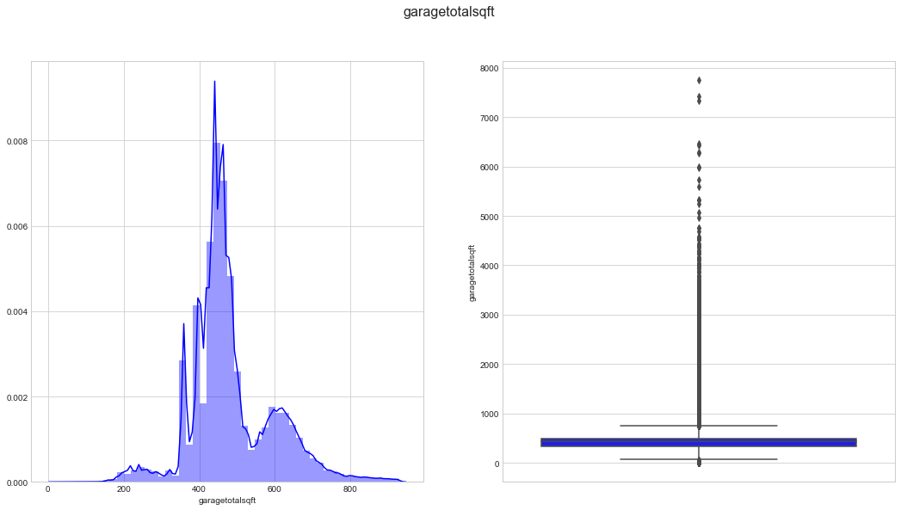

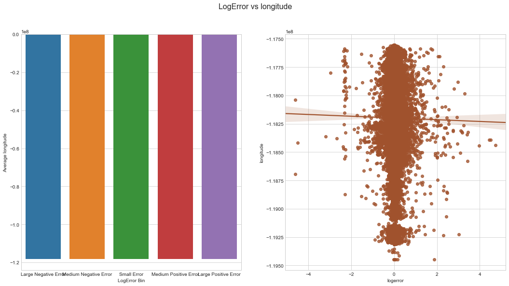

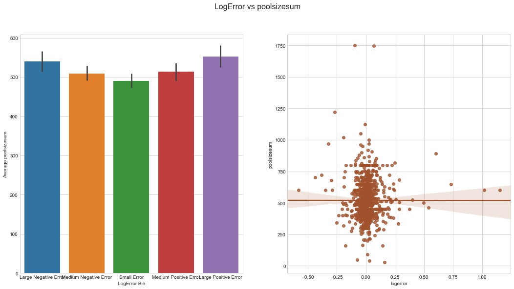

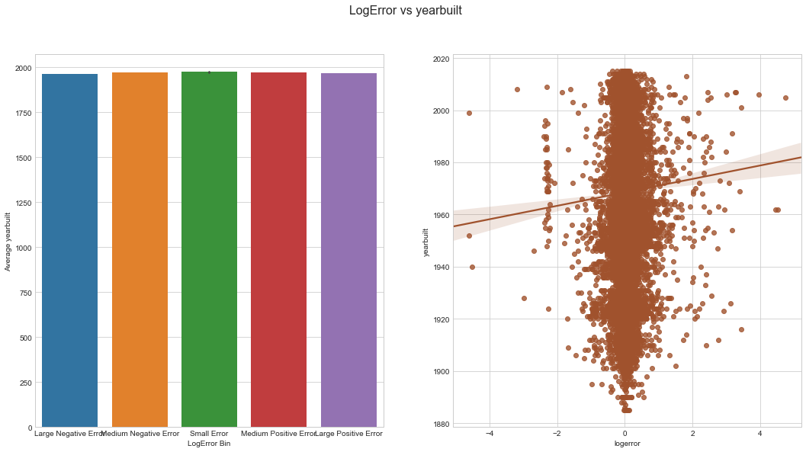

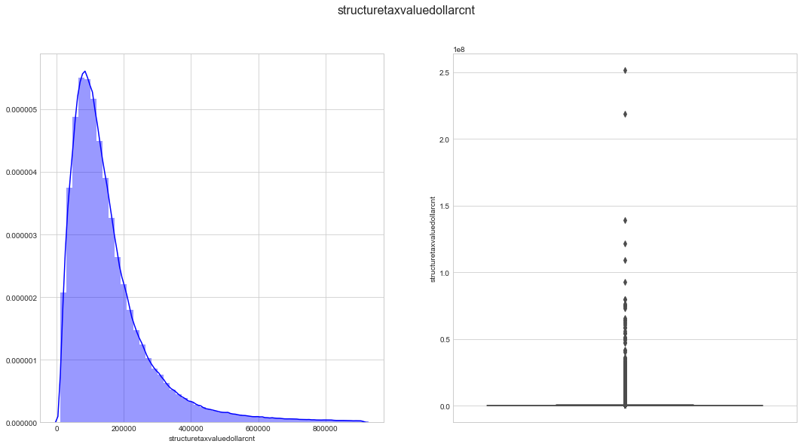

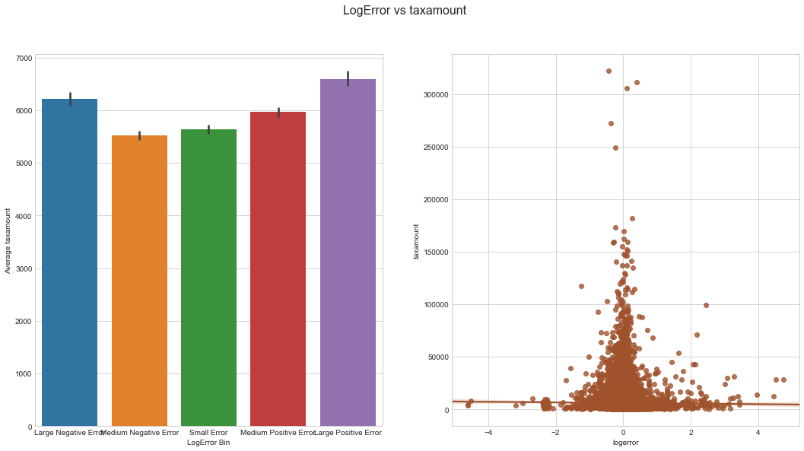

## Supplemental figures

    (90275, 3)

    ---------------------------------------------------------------------------

    NameError                                 Traceback (most recent call last)

    <ipython-input-14-9ba60351fb19> in <module>()
          1 plt.figure(figsize=(8,6))
    ----> 2 plt.scatter(range(train.shape[0]), np.sort(train.logerror.values))
          3 plt.xlabel('index', fontsize=12)
          4 plt.ylabel('logerror', fontsize=12)
          5 plt.show()

    NameError: name 'train' is not defined

    <matplotlib.figure.Figure at 0x10feda240>

Distribution of Target Variable:

Log-errors are close to normally distributed around a 0 mean, but with a slightly positive skew. There are also a considerable number of outliers, I will explore whether removing these improves model performance.

Proportion of Missing Values in Each Column:

## Analyse the Dimensions of our Datasets

There are several columns which have a very high proportion of missing values. It may be worth analysing these more closely.

### Monthly Effects on Target Variable

For submission we are required to predict values for October, November and December. The differing distributions of the target variable over these months indicates that it may be useful to create an additional 'transaction_month' feature as shown above. Lets have a closer look at the distribution across only October, November and December.

Proportion of Transactions in Each Month

This datase contains more transactions occuring in the Spring and Summer months, although it must be noted that some transactions from October, November and December have been removed to form the competition's test set (thanks to nonrandom for pointing this out).

Feature Importance

Here we see that the greatest importance in predicting the log-error comes from features involving taxes and geographical location of the property. Notably, the 'transaction_month' feature that was engineered earlier was the 12th most important feature. 

## Bibliography

Pérez, F., and B. E. Granger. 2007. “IPython: A System for Interactive Scientific Computing.” Computing in Science & Engineering 9 (3): 21–29.

