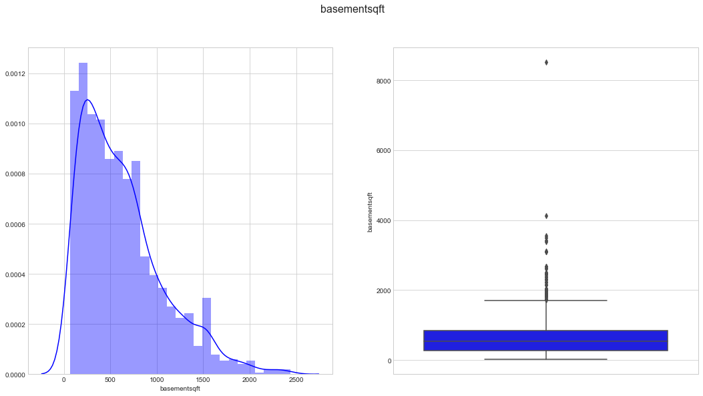
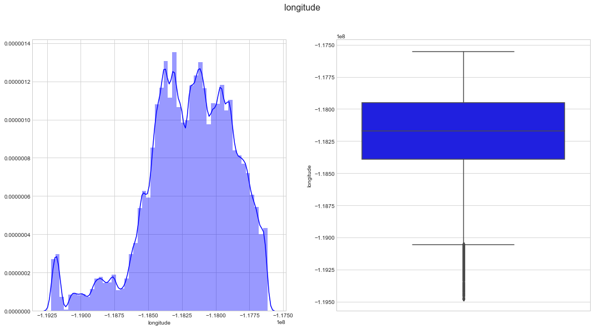
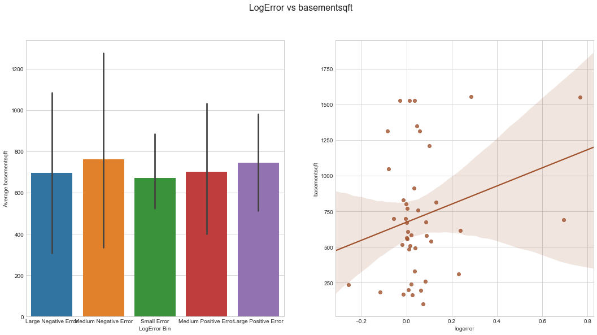

# Zillow prize data analysis report

    This report was last updated on 2017-10-11 at 12:04:56

## Introduction

The [Zillow Prize](https://www.zillow.com/promo/Zillow-prize/) is a [Kaggle competition](https://www.kaggle.com/c/zillow-prize-1) that aims to inspire data scientists around the world to improve the accuracy of the Zillow "Zestimate" statistical and machine learning models. 

My goal is to compete for the Zillow prize and write up my results.

## Methods

### Data

The data were obtained from [Kaggle website](https://www.kaggle.com/c/zillow-prize-1/data) and consist of the following files:
- `properties_2016.csv.zip`
- `properties_2017.csv.zip`
- `sample_submission.csv`
- `train_2016_v2.csv.zip`
- `train_2017.csv.zip`
- `zillow_data_dictionary.xlsx` 
The `zillow_data_dictionary.xlsx` is a code book that explains the data.
This data will be made available on [figshare](https://figshare.com/) to provide an additional source if the [Kaggle site data](https://www.kaggle.com/c/zillow-prize-1/data) become unavailable.

### Analysis

Data analysis was done in Jupyter Notebook (Pérez and Granger 2007)<cite data-cite="5251998/SH25XT8L"></cite> Integrated Development Environment using the Python language (Pérez, Granger, and Hunter 2011)<cite data-cite="5251998/FGTD82L2"></cite> and a number of software packages:

- NumPy (van der Walt, Colbert, and Varoquaux 2011)<cite data-cite="5251998/3SWILWGR"></cite>

- pandas (McKinney 2010)<cite data-cite="5251998/K3NZPGU9"></cite>

- scikit-learn (Pedregosa et al. 2011)<cite data-cite="5251998/SBYLEUVD"></cite>

### Visualization

The following packages were used to visualize the data:

- Matplotlib (Hunter 2007)<cite data-cite="5251998/WP5LZ6AZ"></cite>

- Seaborn (Waskom et al. 2014)<cite data-cite="5251998/NSFX6VMN"></cite>

### Reproducibility

Reproducibility is extremely important in scientific research yet many examples of problematic studies exist in the literature (Couzin-Frankel 2010)<cite data-cite="5251998/UXR4ZTUS"></cite>.

The names and versions of each package used herein are listed in the accompanying `env.yml` file in the `config` folder.
The computational environment used to analyze the data can be recreated using this `env.yml` file and the [`conda` package and environment manager](https://conda.io/docs/using/envs.html) available as part of the [Anaconda distribution of Python](https://www.anaconda.com/download/).

Additionally, details on how to setup a Docker image capable of running the analysis is included in the `README.md` file in the `config` folder.

The code in the form of a jupyter notebook (`01_zillow_MWS.ipynb`) or Python script (`01_zillow_MWS.py`), can also be run on the Kaggle website (this requires logging in with a username and password).

More information on the details of how this project was created and the computational environment was configured can be found in the accompanying `README.md` file.

This Python 3 environment comes with many helpful analytics libraries installed
It is defined by the kaggle/python docker image: https://github.com/kaggle/docker-python (a modified version of this docker image will be made available as part of my project to ensure reproducibility).
For example, here's several helpful packages to load in 

## Results

Import Libraries and Data:

Input data files are available in the "../input/" directory.

Any results I write to the current directory are saved as output.

<table border="1" class="dataframe">
  <thead>
    <tr style="text-align: right;">
      <th></th>
      <th>parcelid</th>
      <th>logerror</th>
      <th>transactiondate</th>
    </tr>
  </thead>
  <tbody>
    <tr>
      <th>0</th>
      <td>11016594</td>
      <td>0.0276</td>
      <td>2016-01-01</td>
    </tr>
    <tr>
      <th>1</th>
      <td>14366692</td>
      <td>-0.1684</td>
      <td>2016-01-01</td>
    </tr>
    <tr>
      <th>2</th>
      <td>12098116</td>
      <td>-0.0040</td>
      <td>2016-01-01</td>
    </tr>
    <tr>
      <th>3</th>
      <td>12643413</td>
      <td>0.0218</td>
      <td>2016-01-02</td>
    </tr>
    <tr>
      <th>4</th>
      <td>14432541</td>
      <td>-0.0050</td>
      <td>2016-01-02</td>
    </tr>
  </tbody>
</table>

<table border="1" class="dataframe">
  <thead>
    <tr style="text-align: right;">
      <th></th>
      <th>parcelid</th>
      <th>airconditioningtypeid</th>
      <th>architecturalstyletypeid</th>
      <th>basementsqft</th>
      <th>bathroomcnt</th>
      <th>bedroomcnt</th>
      <th>buildingclasstypeid</th>
      <th>buildingqualitytypeid</th>
      <th>calculatedbathnbr</th>
      <th>decktypeid</th>
      <th>...</th>
      <th>structuretaxvaluedollarcnt</th>
      <th>taxvaluedollarcnt</th>
      <th>assessmentyear</th>
      <th>landtaxvaluedollarcnt</th>
      <th>taxamount</th>
      <th>taxdelinquencyflag</th>
      <th>taxdelinquencyyear</th>
      <th>censustractandblock</th>
      <th>logerror</th>
      <th>transactiondate</th>
    </tr>
  </thead>
  <tbody>
    <tr>
      <th>0</th>
      <td>17073783</td>
      <td>NaN</td>
      <td>NaN</td>
      <td>NaN</td>
      <td>2.5</td>
      <td>3.0</td>
      <td>NaN</td>
      <td>NaN</td>
      <td>2.5</td>
      <td>NaN</td>
      <td>...</td>
      <td>115087.0</td>
      <td>191811.0</td>
      <td>2015.0</td>
      <td>76724.0</td>
      <td>2015.06</td>
      <td>NaN</td>
      <td>NaN</td>
      <td>61110022003007</td>
      <td>0.0953</td>
      <td>2016-01-27</td>
    </tr>
    <tr>
      <th>1</th>
      <td>17088994</td>
      <td>NaN</td>
      <td>NaN</td>
      <td>NaN</td>
      <td>1.0</td>
      <td>2.0</td>
      <td>NaN</td>
      <td>NaN</td>
      <td>1.0</td>
      <td>NaN</td>
      <td>...</td>
      <td>143809.0</td>
      <td>239679.0</td>
      <td>2015.0</td>
      <td>95870.0</td>
      <td>2581.30</td>
      <td>NaN</td>
      <td>NaN</td>
      <td>61110015031002</td>
      <td>0.0198</td>
      <td>2016-03-30</td>
    </tr>
    <tr>
      <th>2</th>
      <td>17100444</td>
      <td>NaN</td>
      <td>NaN</td>
      <td>NaN</td>
      <td>2.0</td>
      <td>3.0</td>
      <td>NaN</td>
      <td>NaN</td>
      <td>2.0</td>
      <td>NaN</td>
      <td>...</td>
      <td>33619.0</td>
      <td>47853.0</td>
      <td>2015.0</td>
      <td>14234.0</td>
      <td>591.64</td>
      <td>NaN</td>
      <td>NaN</td>
      <td>61110007011007</td>
      <td>0.0060</td>
      <td>2016-05-27</td>
    </tr>
    <tr>
      <th>3</th>
      <td>17102429</td>
      <td>NaN</td>
      <td>NaN</td>
      <td>NaN</td>
      <td>1.5</td>
      <td>2.0</td>
      <td>NaN</td>
      <td>NaN</td>
      <td>1.5</td>
      <td>NaN</td>
      <td>...</td>
      <td>45609.0</td>
      <td>62914.0</td>
      <td>2015.0</td>
      <td>17305.0</td>
      <td>682.78</td>
      <td>NaN</td>
      <td>NaN</td>
      <td>61110008002013</td>
      <td>-0.0566</td>
      <td>2016-06-07</td>
    </tr>
    <tr>
      <th>4</th>
      <td>17109604</td>
      <td>NaN</td>
      <td>NaN</td>
      <td>NaN</td>
      <td>2.5</td>
      <td>4.0</td>
      <td>NaN</td>
      <td>NaN</td>
      <td>2.5</td>
      <td>NaN</td>
      <td>...</td>
      <td>277000.0</td>
      <td>554000.0</td>
      <td>2015.0</td>
      <td>277000.0</td>
      <td>5886.92</td>
      <td>NaN</td>
      <td>NaN</td>
      <td>61110014021007</td>
      <td>0.0573</td>
      <td>2016-08-08</td>
    </tr>
  </tbody>
</table>

5 rows × 60 columns

    Large Negative Error     18442
    Small Error              18432
    Medium Negative Error    17973
    Large Positive Error     17947
    Medium Positive Error    17481
    Name: logerror_bin, dtype: int64

## Supplemental figures

In Progress

    (90275, 3)

    ---------------------------------------------------------------------------

    NameError                                 Traceback (most recent call last)

    <ipython-input-14-9ba60351fb19> in <module>()
          1 plt.figure(figsize=(8,6))
    ----> 2 plt.scatter(range(train.shape[0]), np.sort(train.logerror.values))
          3 plt.xlabel('index', fontsize=12)
          4 plt.ylabel('logerror', fontsize=12)
          5 plt.show()

    NameError: name 'train' is not defined

    <matplotlib.figure.Figure at 0x10feda240>

Distribution of Target Variable:

Log-errors are close to normally distributed around a 0 mean, but with a slightly positive skew. There are also a considerable number of outliers, I will explore whether removing these improves model performance.

Proportion of Missing Values in Each Column:

There are several columns which have a very high proportion of missing values. It may be worth analysing these more closely.

For submission we are required to predict values for October, November and December. The differing distributions of the target variable over these months indicates that it may be useful to create an additional 'transaction_month' feature as shown above. Lets have a closer look at the distribution across only October, November and December.

Proportion of Transactions in Each Month

Feature Importance

Here we see that the greatest importance in predicting the log-error comes from features involving taxes and geographical location of the property. Notably, the 'transaction_month' feature that was engineered earlier was the 12th most important feature. 

## Conclusions

In Progress

## Bibliography

Couzin-Frankel, J. 2010. “Cancer Research. As Questions Grow, Duke Halts Trials, Launches Investigation.” Science 329 (5992): 614–15. 

Hunter, J. D. 2007. “Matplotlib: A 2D Graphics Environment.” Computing In Science & Engineering 9 (3): 90–95.

McKinney, W. 2010. “Data Structures for Statistical Computing in Python.” In Proceedings of the 9th Python in Science Conference, edited by S. J. van der Walt and K. J. Millman. Austin, Texas.

Pedregosa, Fabian, Gaël Varoquaux, Alexandre Gramfort, Vincent Michel, Bertrand Thirion, Olivier Grisel, Mathieu Blondel, et al. 2011. “Scikit-Learn: Machine Learning in Python.” Journal of Machine Learning Research 12 (Oct): 2825–30.

Pérez, F., and B. E. Granger. 2007. “IPython: A System for Interactive Scientific Computing.” Computing in Science & Engineering 9 (3): 21–29.

Pérez, F., B. E. Granger, and J. D. Hunter. 2011. “Python: An Ecosystem for Scientific Computing.” Computing in Science & Engineering 13 (2): 13–21.

Van der Walt, S., S. C. Colbert, and G. Varoquaux. 2011. “The NumPy Array: A Structure for Efficient Numerical Computation.” Computing in Science & Engineering 13 (2): 22–30.

Waskom, M, O Botvinnik, P Hobson, J Warmenhoven, JB Cole, Y Halchenko, J Vanderplas, et al. 2014. Seaborn: Statistical Data Visualization. Stanford, California.

