# Zillow prize data analysis report

    This report was last updated on 2017-10-11 at 21:48:08

## Introduction

The [Zillow Prize](https://www.zillow.com/promo/Zillow-prize/) is a [Kaggle competition](https://www.kaggle.com/c/zillow-prize-1) that aims to inspire data scientists around the world to improve the accuracy of the Zillow "Zestimate" statistical and machine learning models. 

My goal is to compete for the Zillow prize and write up my results.

## Methods

### Data

The data were obtained from [Kaggle website](https://www.kaggle.com/c/zillow-prize-1/data) and consist of the following files:
- `properties_2016.csv.zip`
- `properties_2017.csv.zip`
- `sample_submission.csv`
- `train_2016_v2.csv.zip`
- `train_2017.csv.zip`
- `zillow_data_dictionary.xlsx` 
The `zillow_data_dictionary.xlsx` is a code book that explains the data.
This data will be made available on [figshare](https://figshare.com/) to provide an additional source if the [Kaggle site data](https://www.kaggle.com/c/zillow-prize-1/data) become unavailable.

### Analysis

Data analysis was done in Jupyter Notebook (Pérez and Granger 2007)<cite data-cite="5251998/SH25XT8L"></cite> Integrated Development Environment using the Python language (Pérez, Granger, and Hunter 2011)<cite data-cite="5251998/FGTD82L2"></cite> and a number of software packages:

- NumPy (van der Walt, Colbert, and Varoquaux 2011)<cite data-cite="5251998/3SWILWGR"></cite>

- pandas (McKinney 2010)<cite data-cite="5251998/K3NZPGU9"></cite>

- scikit-learn (Pedregosa et al. 2011)<cite data-cite="5251998/SBYLEUVD"></cite>

### Visualization

The following packages were used to visualize the data:

- Matplotlib (Hunter 2007)<cite data-cite="5251998/WP5LZ6AZ"></cite>

- Seaborn (Waskom et al. 2014)<cite data-cite="5251998/NSFX6VMN"></cite>

### Reproducibility

Reproducibility is extremely important in scientific research yet many examples of problematic studies exist in the literature (Couzin-Frankel 2010)<cite data-cite="5251998/UXR4ZTUS"></cite>.

The names and versions of each package used herein are listed in the accompanying `env.yml` file in the `config` folder.
The computational environment used to analyze the data can be recreated using this `env.yml` file and the [`conda` package and environment manager](https://conda.io/docs/using/envs.html) available as part of the [Anaconda distribution of Python](https://www.anaconda.com/download/).

Additionally, details on how to setup a Docker image capable of running the analysis is included in the `README.md` file in the `config` folder.

The code in the form of a jupyter notebook (`01_zillow_MWS.ipynb`) or Python script (`01_zillow_MWS.py`), can also be run on the Kaggle website (this requires logging in with a username and password).

More information on the details of how this project was created and the computational environment was configured can be found in the accompanying `README.md` file.

This Python 3 environment comes with many helpful analytics libraries installed
It is defined by the kaggle/python docker image: https://github.com/kaggle/docker-python (a modified version of this docker image will be made available as part of my project to ensure reproducibility).
For example, here's several helpful packages to load in 

## Results

### Import Libraries and Data

Input data files are available in the "../input/" directory.

Any results I write to the current directory are saved as output.

### Exploratory Data Analysis

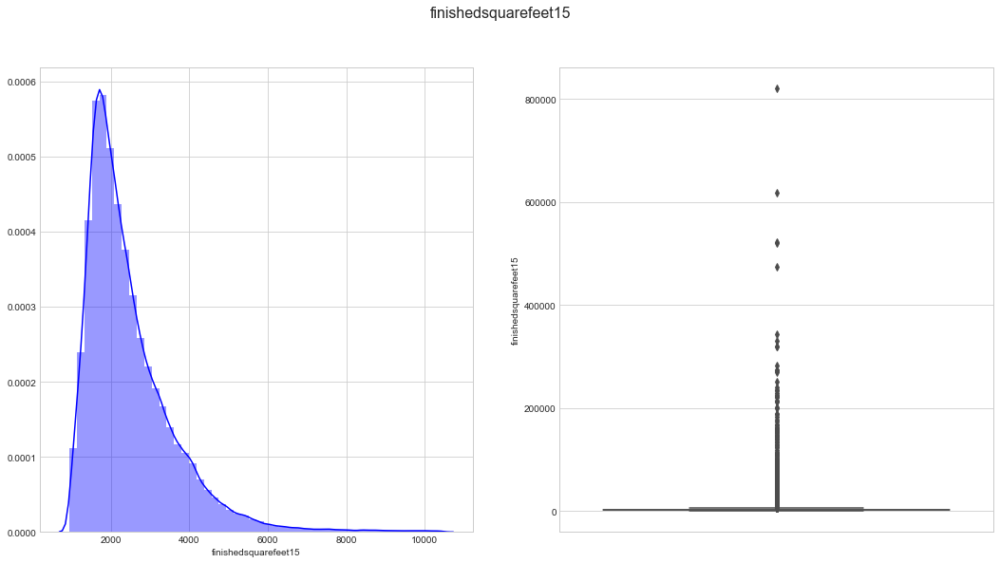

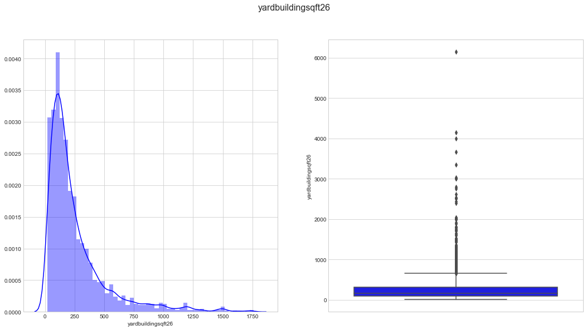

<table border="1" class="dataframe">
  <thead>
    <tr style="text-align: right;">
      <th></th>
      <th>parcelid</th>
      <th>logerror</th>
      <th>transactiondate</th>
    </tr>
  </thead>
  <tbody>
    <tr>
      <th>0</th>
      <td>11016594</td>
      <td>0.0276</td>
      <td>2016-01-01</td>
    </tr>
    <tr>
      <th>1</th>
      <td>14366692</td>
      <td>-0.1684</td>
      <td>2016-01-01</td>
    </tr>
    <tr>
      <th>2</th>
      <td>12098116</td>
      <td>-0.0040</td>
      <td>2016-01-01</td>
    </tr>
    <tr>
      <th>3</th>
      <td>12643413</td>
      <td>0.0218</td>
      <td>2016-01-02</td>
    </tr>
    <tr>
      <th>4</th>
      <td>14432541</td>
      <td>-0.0050</td>
      <td>2016-01-02</td>
    </tr>
  </tbody>
</table>

<table border="1" class="dataframe">
  <thead>
    <tr style="text-align: right;">
      <th></th>
      <th>parcelid</th>
      <th>airconditioningtypeid</th>
      <th>architecturalstyletypeid</th>
      <th>basementsqft</th>
      <th>bathroomcnt</th>
      <th>bedroomcnt</th>
      <th>buildingclasstypeid</th>
      <th>buildingqualitytypeid</th>
      <th>calculatedbathnbr</th>
      <th>decktypeid</th>
      <th>...</th>
      <th>structuretaxvaluedollarcnt</th>
      <th>taxvaluedollarcnt</th>
      <th>assessmentyear</th>
      <th>landtaxvaluedollarcnt</th>
      <th>taxamount</th>
      <th>taxdelinquencyflag</th>
      <th>taxdelinquencyyear</th>
      <th>censustractandblock</th>
      <th>logerror</th>
      <th>transactiondate</th>
    </tr>
  </thead>
  <tbody>
    <tr>
      <th>0</th>
      <td>17073783</td>
      <td>NaN</td>
      <td>NaN</td>
      <td>NaN</td>
      <td>2.5</td>
      <td>3.0</td>
      <td>NaN</td>
      <td>NaN</td>
      <td>2.5</td>
      <td>NaN</td>
      <td>...</td>
      <td>115087.0</td>
      <td>191811.0</td>
      <td>2015.0</td>
      <td>76724.0</td>
      <td>2015.06</td>
      <td>NaN</td>
      <td>NaN</td>
      <td>61110022003007</td>
      <td>0.0953</td>
      <td>2016-01-27</td>
    </tr>
    <tr>
      <th>1</th>
      <td>17088994</td>
      <td>NaN</td>
      <td>NaN</td>
      <td>NaN</td>
      <td>1.0</td>
      <td>2.0</td>
      <td>NaN</td>
      <td>NaN</td>
      <td>1.0</td>
      <td>NaN</td>
      <td>...</td>
      <td>143809.0</td>
      <td>239679.0</td>
      <td>2015.0</td>
      <td>95870.0</td>
      <td>2581.30</td>
      <td>NaN</td>
      <td>NaN</td>
      <td>61110015031002</td>
      <td>0.0198</td>
      <td>2016-03-30</td>
    </tr>
    <tr>
      <th>2</th>
      <td>17100444</td>
      <td>NaN</td>
      <td>NaN</td>
      <td>NaN</td>
      <td>2.0</td>
      <td>3.0</td>
      <td>NaN</td>
      <td>NaN</td>
      <td>2.0</td>
      <td>NaN</td>
      <td>...</td>
      <td>33619.0</td>
      <td>47853.0</td>
      <td>2015.0</td>
      <td>14234.0</td>
      <td>591.64</td>
      <td>NaN</td>
      <td>NaN</td>
      <td>61110007011007</td>
      <td>0.0060</td>
      <td>2016-05-27</td>
    </tr>
    <tr>
      <th>3</th>
      <td>17102429</td>
      <td>NaN</td>
      <td>NaN</td>
      <td>NaN</td>
      <td>1.5</td>
      <td>2.0</td>
      <td>NaN</td>
      <td>NaN</td>
      <td>1.5</td>
      <td>NaN</td>
      <td>...</td>
      <td>45609.0</td>
      <td>62914.0</td>
      <td>2015.0</td>
      <td>17305.0</td>
      <td>682.78</td>
      <td>NaN</td>
      <td>NaN</td>
      <td>61110008002013</td>
      <td>-0.0566</td>
      <td>2016-06-07</td>
    </tr>
    <tr>
      <th>4</th>
      <td>17109604</td>
      <td>NaN</td>
      <td>NaN</td>
      <td>NaN</td>
      <td>2.5</td>
      <td>4.0</td>
      <td>NaN</td>
      <td>NaN</td>
      <td>2.5</td>
      <td>NaN</td>
      <td>...</td>
      <td>277000.0</td>
      <td>554000.0</td>
      <td>2015.0</td>
      <td>277000.0</td>
      <td>5886.92</td>
      <td>NaN</td>
      <td>NaN</td>
      <td>61110014021007</td>
      <td>0.0573</td>
      <td>2016-08-08</td>
    </tr>
  </tbody>
</table>

5 rows × 60 columns

    Large Negative Error     18442
    Small Error              18432
    Medium Negative Error    17973
    Large Positive Error     17947
    Medium Positive Error    17481
    Name: logerror_bin, dtype: int64

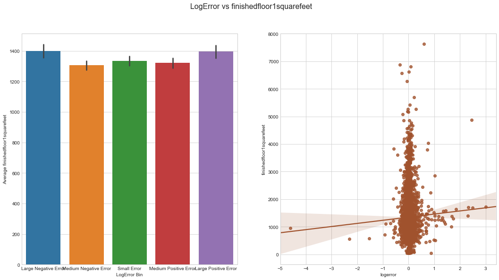

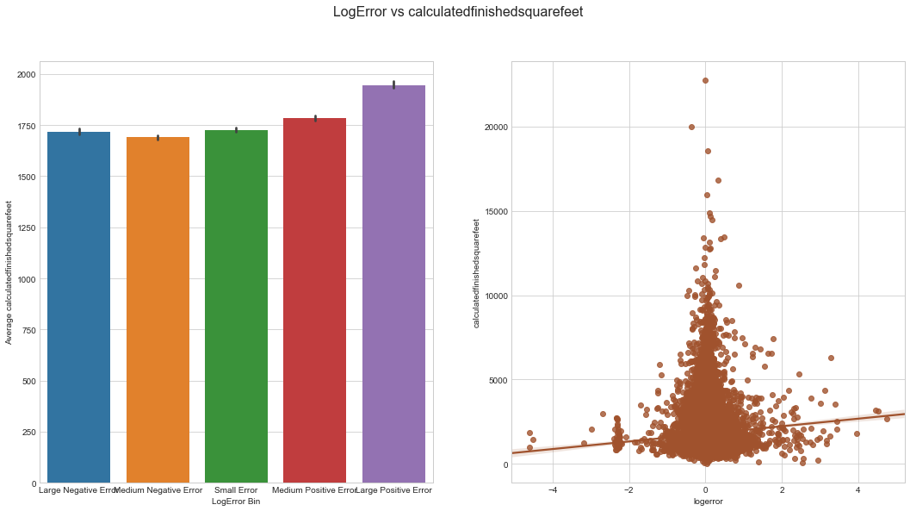

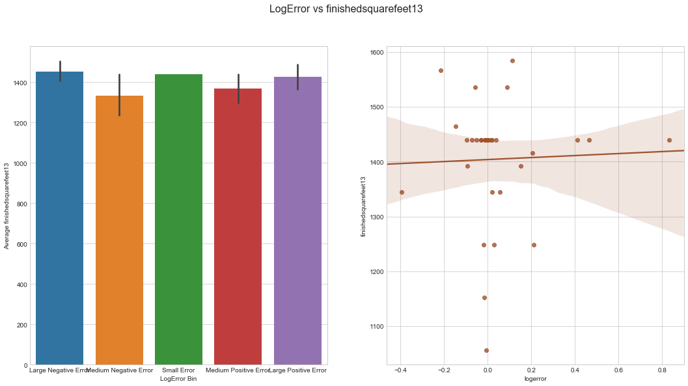

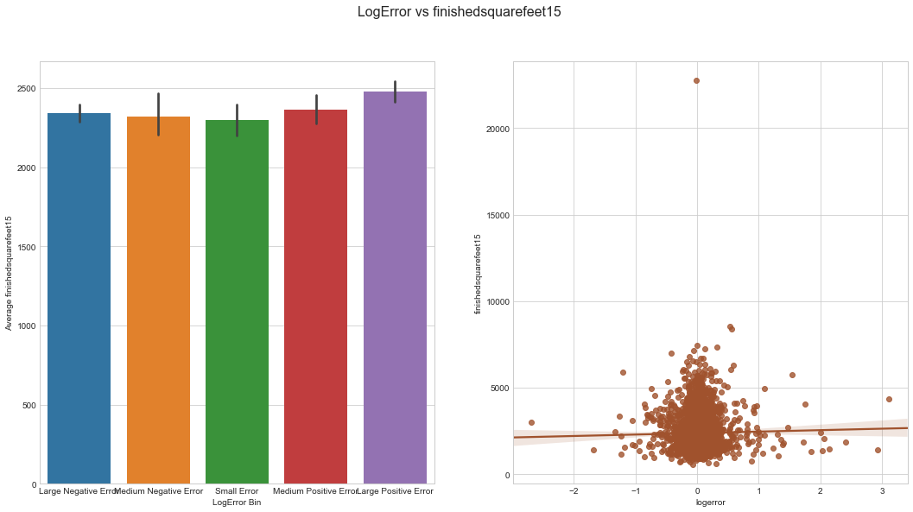

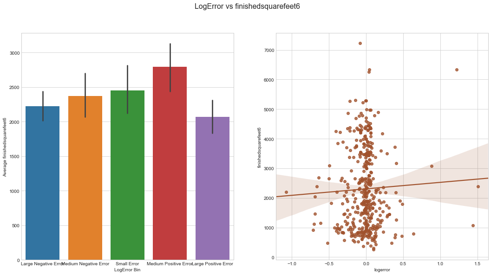

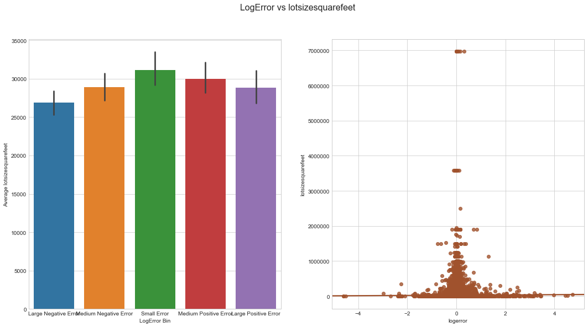

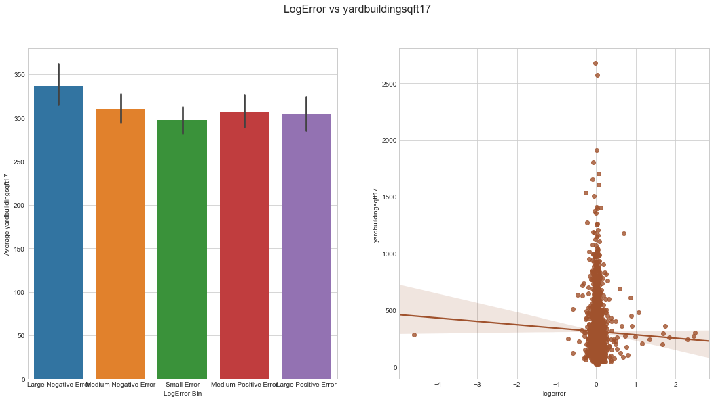

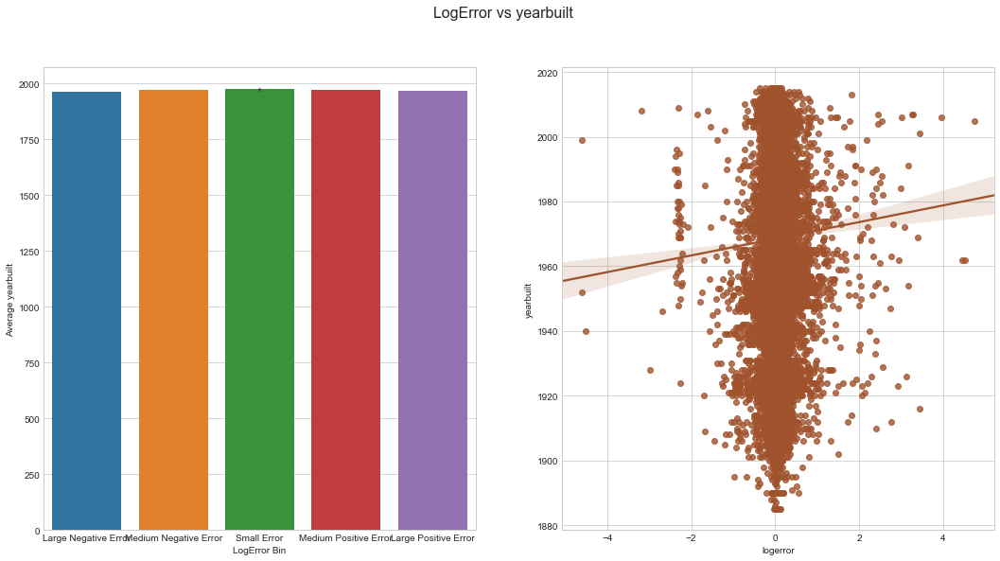

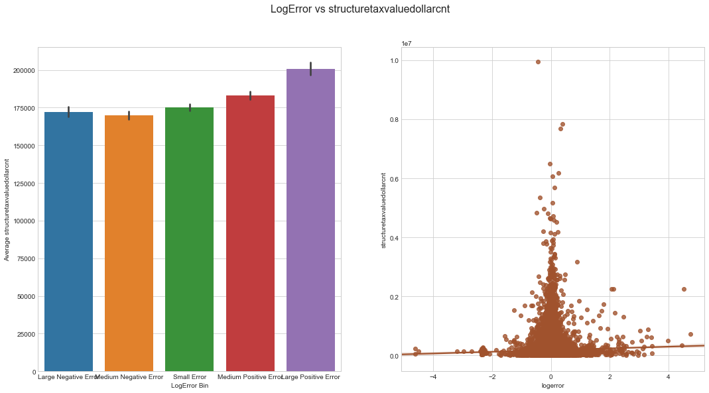

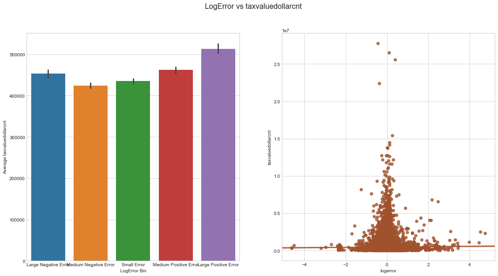

### Prediction

In Progress

## Supplemental figures

In Progress

    (90275, 3)

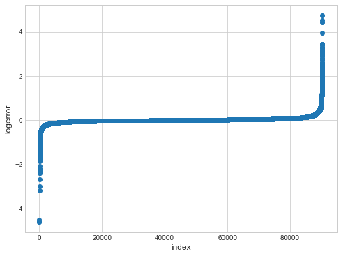

Distribution of Target Variable:

    /Users/marskar/anaconda3/lib/python3.6/site-packages/ipykernel_launcher.py:3: DeprecationWarning: 
    .ix is deprecated. Please use
    .loc for label based indexing or
    .iloc for positional indexing
    
    See the documentation here:
    http://pandas.pydata.org/pandas-docs/stable/indexing.html#ix-indexer-is-deprecated
      This is separate from the ipykernel package so we can avoid doing imports until
    /Users/marskar/anaconda3/lib/python3.6/site-packages/pandas/core/indexing.py:179: SettingWithCopyWarning: 
    A value is trying to be set on a copy of a slice from a DataFrame
    
    See the caveats in the documentation: http://pandas.pydata.org/pandas-docs/stable/indexing.html#indexing-view-versus-copy
      self._setitem_with_indexer(indexer, value)

Log-errors are close to normally distributed around a 0 mean, but with a slightly positive skew. There are also a considerable number of outliers, I will explore whether removing these improves model performance.

Proportion of Missing Values in Each Column:

    /Users/marskar/anaconda3/lib/python3.6/site-packages/IPython/core/interactiveshell.py:2728: DtypeWarning: Columns (22,32,34,49,55) have mixed types. Specify dtype option on import or set low_memory=False.
      interactivity=interactivity, compiler=compiler, result=result)

       parcelid  airconditioningtypeid  architecturalstyletypeid  basementsqft  \
    0  10754147                    NaN                       NaN           NaN   
    1  10759547                    NaN                       NaN           NaN   
    2  10843547                    NaN                       NaN           NaN   
    3  10859147                    NaN                       NaN           NaN   
    4  10879947                    NaN                       NaN           NaN   
    
       bathroomcnt  bedroomcnt  buildingclasstypeid  buildingqualitytypeid  \
    0          0.0         0.0                  NaN                    NaN   
    1          0.0         0.0                  NaN                    NaN   
    2          0.0         0.0                  NaN                    NaN   
    3          0.0         0.0                  3.0                    7.0   
    4          0.0         0.0                  4.0                    NaN   
    
       calculatedbathnbr  decktypeid         ...           numberofstories  \
    0                NaN         NaN         ...                       NaN   
    1                NaN         NaN         ...                       NaN   
    2                NaN         NaN         ...                       NaN   
    3                NaN         NaN         ...                       1.0   
    4                NaN         NaN         ...                       NaN   
    
       fireplaceflag  structuretaxvaluedollarcnt  taxvaluedollarcnt  \
    0            NaN                         NaN                9.0   
    1            NaN                         NaN            27516.0   
    2            NaN                    650756.0          1413387.0   
    3            NaN                    571346.0          1156834.0   
    4            NaN                    193796.0           433491.0   
    
       assessmentyear  landtaxvaluedollarcnt  taxamount  taxdelinquencyflag  \
    0          2015.0                    9.0        NaN                 NaN   
    1          2015.0                27516.0        NaN                 NaN   
    2          2015.0               762631.0   20800.37                 NaN   
    3          2015.0               585488.0   14557.57                 NaN   
    4          2015.0               239695.0    5725.17                 NaN   
    
       taxdelinquencyyear  censustractandblock  
    0                 NaN                  NaN  
    1                 NaN                  NaN  
    2                 NaN                  NaN  
    3                 NaN                  NaN  
    4                 NaN                  NaN  
    
    [5 rows x 58 columns]
    ---------------------
    (2985217, 58)

    1    90026
    2      123
    3        1
    Name: parcelid, dtype: int64

    /Users/marskar/anaconda3/lib/python3.6/site-packages/IPython/core/interactiveshell.py:2728: DtypeWarning: Columns (22,32,34,49,55) have mixed types. Specify dtype option on import or set low_memory=False.
      interactivity=interactivity, compiler=compiler, result=result)

    (2985217, 58)

<table border="1" class="dataframe">
  <thead>
    <tr style="text-align: right;">
      <th></th>
      <th>parcelid</th>
      <th>airconditioningtypeid</th>
      <th>architecturalstyletypeid</th>
      <th>basementsqft</th>
      <th>bathroomcnt</th>
      <th>bedroomcnt</th>
      <th>buildingclasstypeid</th>
      <th>buildingqualitytypeid</th>
      <th>calculatedbathnbr</th>
      <th>decktypeid</th>
      <th>...</th>
      <th>numberofstories</th>
      <th>fireplaceflag</th>
      <th>structuretaxvaluedollarcnt</th>
      <th>taxvaluedollarcnt</th>
      <th>assessmentyear</th>
      <th>landtaxvaluedollarcnt</th>
      <th>taxamount</th>
      <th>taxdelinquencyflag</th>
      <th>taxdelinquencyyear</th>
      <th>censustractandblock</th>
    </tr>
  </thead>
  <tbody>
    <tr>
      <th>0</th>
      <td>10754147</td>
      <td>NaN</td>
      <td>NaN</td>
      <td>NaN</td>
      <td>0.0</td>
      <td>0.0</td>
      <td>NaN</td>
      <td>NaN</td>
      <td>NaN</td>
      <td>NaN</td>
      <td>...</td>
      <td>NaN</td>
      <td>NaN</td>
      <td>NaN</td>
      <td>9.0</td>
      <td>2015.0</td>
      <td>9.0</td>
      <td>NaN</td>
      <td>NaN</td>
      <td>NaN</td>
      <td>NaN</td>
    </tr>
    <tr>
      <th>1</th>
      <td>10759547</td>
      <td>NaN</td>
      <td>NaN</td>
      <td>NaN</td>
      <td>0.0</td>
      <td>0.0</td>
      <td>NaN</td>
      <td>NaN</td>
      <td>NaN</td>
      <td>NaN</td>
      <td>...</td>
      <td>NaN</td>
      <td>NaN</td>
      <td>NaN</td>
      <td>27516.0</td>
      <td>2015.0</td>
      <td>27516.0</td>
      <td>NaN</td>
      <td>NaN</td>
      <td>NaN</td>
      <td>NaN</td>
    </tr>
    <tr>
      <th>2</th>
      <td>10843547</td>
      <td>NaN</td>
      <td>NaN</td>
      <td>NaN</td>
      <td>0.0</td>
      <td>0.0</td>
      <td>NaN</td>
      <td>NaN</td>
      <td>NaN</td>
      <td>NaN</td>
      <td>...</td>
      <td>NaN</td>
      <td>NaN</td>
      <td>650756.0</td>
      <td>1413387.0</td>
      <td>2015.0</td>
      <td>762631.0</td>
      <td>20800.37</td>
      <td>NaN</td>
      <td>NaN</td>
      <td>NaN</td>
    </tr>
    <tr>
      <th>3</th>
      <td>10859147</td>
      <td>NaN</td>
      <td>NaN</td>
      <td>NaN</td>
      <td>0.0</td>
      <td>0.0</td>
      <td>3.0</td>
      <td>7.0</td>
      <td>NaN</td>
      <td>NaN</td>
      <td>...</td>
      <td>1.0</td>
      <td>NaN</td>
      <td>571346.0</td>
      <td>1156834.0</td>
      <td>2015.0</td>
      <td>585488.0</td>
      <td>14557.57</td>
      <td>NaN</td>
      <td>NaN</td>
      <td>NaN</td>
    </tr>
    <tr>
      <th>4</th>
      <td>10879947</td>
      <td>NaN</td>
      <td>NaN</td>
      <td>NaN</td>
      <td>0.0</td>
      <td>0.0</td>
      <td>4.0</td>
      <td>NaN</td>
      <td>NaN</td>
      <td>NaN</td>
      <td>...</td>
      <td>NaN</td>
      <td>NaN</td>
      <td>193796.0</td>
      <td>433491.0</td>
      <td>2015.0</td>
      <td>239695.0</td>
      <td>5725.17</td>
      <td>NaN</td>
      <td>NaN</td>
      <td>NaN</td>
    </tr>
  </tbody>
</table>

5 rows × 58 columns

    (90275, 3)

    /Users/marskar/anaconda3/lib/python3.6/site-packages/ipykernel_launcher.py:3: DeprecationWarning: 
    .ix is deprecated. Please use
    .loc for label based indexing or
    .iloc for positional indexing
    
    See the documentation here:
    http://pandas.pydata.org/pandas-docs/stable/indexing.html#ix-indexer-is-deprecated
      This is separate from the ipykernel package so we can avoid doing imports until

    <matplotlib.figure.Figure at 0x1193d8160>

<table border="1" class="dataframe">
  <thead>
    <tr style="text-align: right;">
      <th></th>
      <th>parcelid</th>
      <th>logerror</th>
      <th>transactiondate</th>
      <th>airconditioningtypeid</th>
      <th>architecturalstyletypeid</th>
      <th>basementsqft</th>
      <th>bathroomcnt</th>
      <th>bedroomcnt</th>
      <th>buildingclasstypeid</th>
      <th>buildingqualitytypeid</th>
      <th>...</th>
      <th>numberofstories</th>
      <th>fireplaceflag</th>
      <th>structuretaxvaluedollarcnt</th>
      <th>taxvaluedollarcnt</th>
      <th>assessmentyear</th>
      <th>landtaxvaluedollarcnt</th>
      <th>taxamount</th>
      <th>taxdelinquencyflag</th>
      <th>taxdelinquencyyear</th>
      <th>censustractandblock</th>
    </tr>
  </thead>
  <tbody>
    <tr>
      <th>0</th>
      <td>11016594</td>
      <td>0.0276</td>
      <td>2016-01-01</td>
      <td>1.0</td>
      <td>NaN</td>
      <td>NaN</td>
      <td>2.0</td>
      <td>3.0</td>
      <td>NaN</td>
      <td>4.0</td>
      <td>...</td>
      <td>NaN</td>
      <td>NaN</td>
      <td>122754.0</td>
      <td>360170.0</td>
      <td>2015.0</td>
      <td>237416.0</td>
      <td>6735.88</td>
      <td>NaN</td>
      <td>NaN</td>
      <td>6.037107e+13</td>
    </tr>
    <tr>
      <th>1</th>
      <td>14366692</td>
      <td>-0.1684</td>
      <td>2016-01-01</td>
      <td>NaN</td>
      <td>NaN</td>
      <td>NaN</td>
      <td>3.5</td>
      <td>4.0</td>
      <td>NaN</td>
      <td>NaN</td>
      <td>...</td>
      <td>NaN</td>
      <td>NaN</td>
      <td>346458.0</td>
      <td>585529.0</td>
      <td>2015.0</td>
      <td>239071.0</td>
      <td>10153.02</td>
      <td>NaN</td>
      <td>NaN</td>
      <td>NaN</td>
    </tr>
    <tr>
      <th>2</th>
      <td>12098116</td>
      <td>-0.0040</td>
      <td>2016-01-01</td>
      <td>1.0</td>
      <td>NaN</td>
      <td>NaN</td>
      <td>3.0</td>
      <td>2.0</td>
      <td>NaN</td>
      <td>4.0</td>
      <td>...</td>
      <td>NaN</td>
      <td>NaN</td>
      <td>61994.0</td>
      <td>119906.0</td>
      <td>2015.0</td>
      <td>57912.0</td>
      <td>11484.48</td>
      <td>NaN</td>
      <td>NaN</td>
      <td>6.037464e+13</td>
    </tr>
    <tr>
      <th>3</th>
      <td>12643413</td>
      <td>0.0218</td>
      <td>2016-01-02</td>
      <td>1.0</td>
      <td>NaN</td>
      <td>NaN</td>
      <td>2.0</td>
      <td>2.0</td>
      <td>NaN</td>
      <td>4.0</td>
      <td>...</td>
      <td>NaN</td>
      <td>NaN</td>
      <td>171518.0</td>
      <td>244880.0</td>
      <td>2015.0</td>
      <td>73362.0</td>
      <td>3048.74</td>
      <td>NaN</td>
      <td>NaN</td>
      <td>6.037296e+13</td>
    </tr>
    <tr>
      <th>4</th>
      <td>14432541</td>
      <td>-0.0050</td>
      <td>2016-01-02</td>
      <td>NaN</td>
      <td>NaN</td>
      <td>NaN</td>
      <td>2.5</td>
      <td>4.0</td>
      <td>NaN</td>
      <td>NaN</td>
      <td>...</td>
      <td>2.0</td>
      <td>NaN</td>
      <td>169574.0</td>
      <td>434551.0</td>
      <td>2015.0</td>
      <td>264977.0</td>
      <td>5488.96</td>
      <td>NaN</td>
      <td>NaN</td>
      <td>6.059042e+13</td>
    </tr>
  </tbody>
</table>

5 rows × 60 columns

<table border="1" class="dataframe">
  <thead>
    <tr style="text-align: right;">
      <th></th>
      <th>Column Type</th>
      <th>Count</th>
    </tr>
  </thead>
  <tbody>
    <tr>
      <th>0</th>
      <td>int64</td>
      <td>1</td>
    </tr>
    <tr>
      <th>1</th>
      <td>float64</td>
      <td>53</td>
    </tr>
    <tr>
      <th>2</th>
      <td>datetime64[ns]</td>
      <td>1</td>
    </tr>
    <tr>
      <th>3</th>
      <td>object</td>
      <td>5</td>
    </tr>
  </tbody>
</table>

<table border="1" class="dataframe">
  <thead>
    <tr style="text-align: right;">
      <th></th>
      <th>Column Type</th>
      <th>Count</th>
    </tr>
  </thead>
  <tbody>
    <tr>
      <th>0</th>
      <td>int64</td>
      <td>1</td>
    </tr>
    <tr>
      <th>1</th>
      <td>float64</td>
      <td>53</td>
    </tr>
    <tr>
      <th>2</th>
      <td>datetime64[ns]</td>
      <td>1</td>
    </tr>
    <tr>
      <th>3</th>
      <td>object</td>
      <td>5</td>
    </tr>
  </tbody>
</table>

    /Users/marskar/anaconda3/lib/python3.6/site-packages/ipykernel_launcher.py:4: DeprecationWarning: 
    .ix is deprecated. Please use
    .loc for label based indexing or
    .iloc for positional indexing
    
    See the documentation here:
    http://pandas.pydata.org/pandas-docs/stable/indexing.html#ix-indexer-is-deprecated
      after removing the cwd from sys.path.

<table border="1" class="dataframe">
  <thead>
    <tr style="text-align: right;">
      <th></th>
      <th>column_name</th>
      <th>missing_count</th>
      <th>missing_ratio</th>
    </tr>
  </thead>
  <tbody>
    <tr>
      <th>5</th>
      <td>basementsqft</td>
      <td>90232</td>
      <td>0.999524</td>
    </tr>
    <tr>
      <th>8</th>
      <td>buildingclasstypeid</td>
      <td>90259</td>
      <td>0.999823</td>
    </tr>
    <tr>
      <th>15</th>
      <td>finishedsquarefeet13</td>
      <td>90242</td>
      <td>0.999634</td>
    </tr>
    <tr>
      <th>43</th>
      <td>storytypeid</td>
      <td>90232</td>
      <td>0.999524</td>
    </tr>
  </tbody>
</table>

    /Users/marskar/anaconda3/lib/python3.6/site-packages/numpy/lib/function_base.py:3162: RuntimeWarning: invalid value encountered in true_divide
      c /= stddev[:, None]
    /Users/marskar/anaconda3/lib/python3.6/site-packages/numpy/lib/function_base.py:3163: RuntimeWarning: invalid value encountered in true_divide
      c /= stddev[None, :]

    assessmentyear 1
    storytypeid 1
    pooltypeid2 1
    pooltypeid7 1
    pooltypeid10 1
    poolcnt 1
    decktypeid 1
    buildingclasstypeid 1

    /Users/marskar/anaconda3/lib/python3.6/site-packages/ipykernel_launcher.py:1: DeprecationWarning: 
    .ix is deprecated. Please use
    .loc for label based indexing or
    .iloc for positional indexing
    
    See the documentation here:
    http://pandas.pydata.org/pandas-docs/stable/indexing.html#ix-indexer-is-deprecated
      """Entry point for launching an IPython kernel.

<table border="1" class="dataframe">
  <thead>
    <tr style="text-align: right;">
      <th></th>
      <th>col_labels</th>
      <th>corr_values</th>
    </tr>
  </thead>
  <tbody>
    <tr>
      <th>21</th>
      <td>heatingorsystemtypeid</td>
      <td>-0.019648</td>
    </tr>
    <tr>
      <th>45</th>
      <td>structuretaxvaluedollarcnt</td>
      <td>0.021935</td>
    </tr>
    <tr>
      <th>4</th>
      <td>bedroomcnt</td>
      <td>0.025467</td>
    </tr>
    <tr>
      <th>3</th>
      <td>bathroomcnt</td>
      <td>0.027889</td>
    </tr>
    <tr>
      <th>18</th>
      <td>fullbathcnt</td>
      <td>0.028169</td>
    </tr>
    <tr>
      <th>7</th>
      <td>calculatedbathnbr</td>
      <td>0.028758</td>
    </tr>
    <tr>
      <th>10</th>
      <td>calculatedfinishedsquarefeet</td>
      <td>0.038341</td>
    </tr>
    <tr>
      <th>11</th>
      <td>finishedsquarefeet12</td>
      <td>0.039248</td>
    </tr>
  </tbody>
</table>

    /Users/marskar/anaconda3/lib/python3.6/site-packages/ipykernel_launcher.py:4: DeprecationWarning: 
    .ix is deprecated. Please use
    .loc for label based indexing or
    .iloc for positional indexing
    
    See the documentation here:
    http://pandas.pydata.org/pandas-docs/stable/indexing.html#ix-indexer-is-deprecated
      after removing the cwd from sys.path.
    /Users/marskar/anaconda3/lib/python3.6/site-packages/pandas/core/indexing.py:179: SettingWithCopyWarning: 
    A value is trying to be set on a copy of a slice from a DataFrame
    
    See the caveats in the documentation: http://pandas.pydata.org/pandas-docs/stable/indexing.html#indexing-view-versus-copy
      self._setitem_with_indexer(indexer, value)

    <matplotlib.figure.Figure at 0x1173aa6a0>

    /Users/marskar/anaconda3/lib/python3.6/site-packages/ipykernel_launcher.py:4: DeprecationWarning: 
    .ix is deprecated. Please use
    .loc for label based indexing or
    .iloc for positional indexing
    
    See the documentation here:
    http://pandas.pydata.org/pandas-docs/stable/indexing.html#ix-indexer-is-deprecated
      after removing the cwd from sys.path.
    /Users/marskar/anaconda3/lib/python3.6/site-packages/pandas/core/indexing.py:179: SettingWithCopyWarning: 
    A value is trying to be set on a copy of a slice from a DataFrame
    
    See the caveats in the documentation: http://pandas.pydata.org/pandas-docs/stable/indexing.html#indexing-view-versus-copy
      self._setitem_with_indexer(indexer, value)

    <matplotlib.figure.Figure at 0x1172216d8>

    /Users/marskar/anaconda3/lib/python3.6/site-packages/ipykernel_launcher.py:1: DeprecationWarning: 
    .ix is deprecated. Please use
    .loc for label based indexing or
    .iloc for positional indexing
    
    See the documentation here:
    http://pandas.pydata.org/pandas-docs/stable/indexing.html#ix-indexer-is-deprecated
      """Entry point for launching an IPython kernel.
    /Users/marskar/anaconda3/lib/python3.6/site-packages/pandas/core/indexing.py:179: SettingWithCopyWarning: 
    A value is trying to be set on a copy of a slice from a DataFrame
    
    See the caveats in the documentation: http://pandas.pydata.org/pandas-docs/stable/indexing.html#indexing-view-versus-copy
      self._setitem_with_indexer(indexer, value)

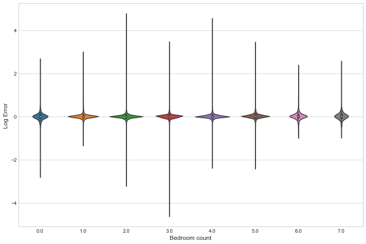

    /Users/marskar/anaconda3/lib/python3.6/site-packages/ggplot/utils.py:81: FutureWarning: pandas.tslib is deprecated and will be removed in a future version.
    You can access Timestamp as pandas.Timestamp
      pd.tslib.Timestamp,
    /Users/marskar/anaconda3/lib/python3.6/site-packages/ggplot/stats/smoothers.py:4: FutureWarning: The pandas.lib module is deprecated and will be removed in a future version. These are private functions and can be accessed from pandas._libs.lib instead
      from pandas.lib import Timestamp
    /Users/marskar/anaconda3/lib/python3.6/site-packages/statsmodels/compat/pandas.py:56: FutureWarning: The pandas.core.datetools module is deprecated and will be removed in a future version. Please use the pandas.tseries module instead.
      from pandas.core import datetools

    ---------------------------------------------------------------------------

    AttributeError                            Traceback (most recent call last)

    ~/anaconda3/lib/python3.6/site-packages/IPython/core/formatters.py in __call__(self, obj)
        700                 type_pprinters=self.type_printers,
        701                 deferred_pprinters=self.deferred_printers)
    --> 702             printer.pretty(obj)
        703             printer.flush()
        704             return stream.getvalue()

    ~/anaconda3/lib/python3.6/site-packages/IPython/lib/pretty.py in pretty(self, obj)
        393                             if callable(meth):
        394                                 return meth(obj, self, cycle)
    --> 395             return _default_pprint(obj, self, cycle)
        396         finally:
        397             self.end_group()

    ~/anaconda3/lib/python3.6/site-packages/IPython/lib/pretty.py in _default_pprint(obj, p, cycle)
        508     if _safe_getattr(klass, '__repr__', None) is not object.__repr__:
        509         # A user-provided repr. Find newlines and replace them with p.break_()
    --> 510         _repr_pprint(obj, p, cycle)
        511         return
        512     p.begin_group(1, '<')

    ~/anaconda3/lib/python3.6/site-packages/IPython/lib/pretty.py in _repr_pprint(obj, p, cycle)
        699     """A pprint that just redirects to the normal repr function."""
        700     # Find newlines and replace them with p.break_()
    --> 701     output = repr(obj)
        702     for idx,output_line in enumerate(output.splitlines()):
        703         if idx:

    ~/anaconda3/lib/python3.6/site-packages/ggplot/ggplot.py in __repr__(self)
        114 
        115     def __repr__(self):
    --> 116         self.make()
        117         # this is nice for dev but not the best for "real"
        118         if os.environ.get("GGPLOT_DEV"):

    ~/anaconda3/lib/python3.6/site-packages/ggplot/ggplot.py in make(self)
        634                         if kwargs==False:
        635                             continue
    --> 636                         layer.plot(ax, facetgroup, self._aes, **kwargs)
        637 
        638             self.apply_limits()

    ~/anaconda3/lib/python3.6/site-packages/ggplot/stats/stat_smooth.py in plot(self, ax, data, _aes)
         75 
         76         smoothed_data = pd.DataFrame(dict(x=x, y=y, y1=y1, y2=y2))
    ---> 77         smoothed_data = smoothed_data.sort('x')
         78 
         79         params = self._get_plot_args(data, _aes)

    ~/anaconda3/lib/python3.6/site-packages/pandas/core/generic.py in __getattr__(self, name)
       3079             if name in self._info_axis:
       3080                 return self[name]
    -> 3081             return object.__getattribute__(self, name)
       3082 
       3083     def __setattr__(self, name, value):

    AttributeError: 'DataFrame' object has no attribute 'sort'

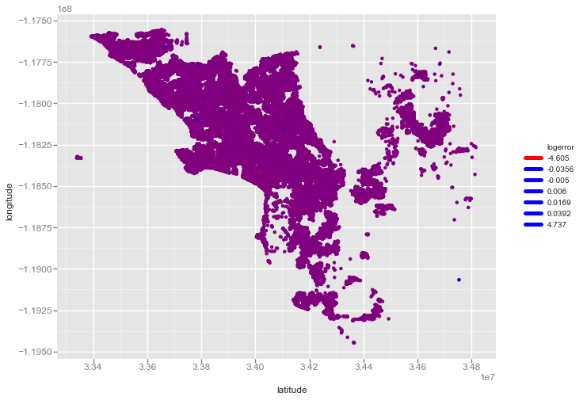

    <ggplot: (-9223372036563207308)>

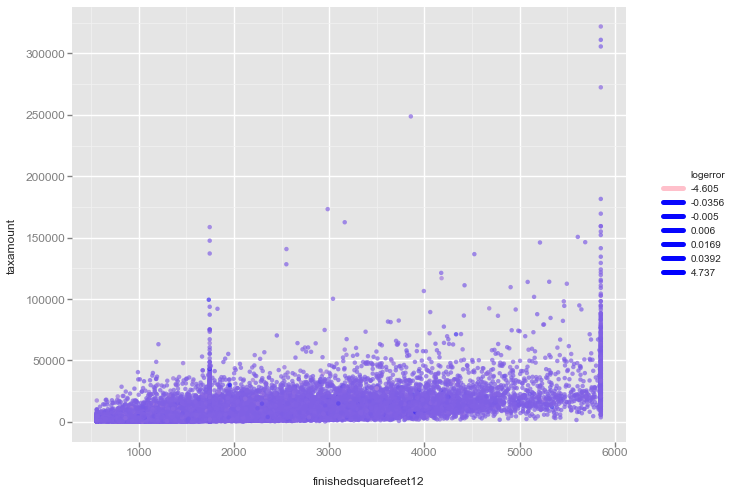

    <ggplot: (-9223372036562264807)>

    Put a bird on it!

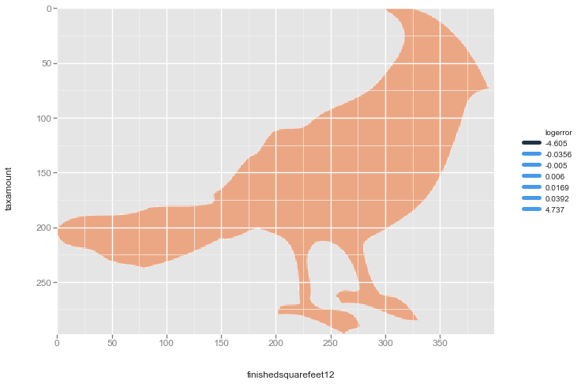

    <ggplot: (-9223372036557124692)>

    /Users/marskar/anaconda3/lib/python3.6/site-packages/sklearn/cross_validation.py:41: DeprecationWarning: This module was deprecated in version 0.18 in favor of the model_selection module into which all the refactored classes and functions are moved. Also note that the interface of the new CV iterators are different from that of this module. This module will be removed in 0.20.
      "This module will be removed in 0.20.", DeprecationWarning)

    Training Size:(90275, 3)
    Property Size:(2985217, 58)

    parcelid                              0
    airconditioningtypeid           2173698
    architecturalstyletypeid        2979156
    basementsqft                    2983589
    bathroomcnt                       11462
    bedroomcnt                        11450
    buildingclasstypeid             2972588
    buildingqualitytypeid           1046729
    calculatedbathnbr                128912
    decktypeid                      2968121
    finishedfloor1squarefeet        2782500
    calculatedfinishedsquarefeet      55565
    finishedsquarefeet12             276033
    finishedsquarefeet13            2977545
    finishedsquarefeet15            2794419
    finishedsquarefeet50            2782500
    finishedsquarefeet6             2963216
    fips                              11437
    fireplacecnt                    2672580
    fullbathcnt                      128912
    garagecarcnt                    2101950
    garagetotalsqft                 2101950
    hashottuborspa                  2916203
    heatingorsystemtypeid           1178816
    latitude                          11437
    longitude                         11437
    lotsizesquarefeet                276099
    poolcnt                         2467683
    poolsizesum                     2957257
    pooltypeid10                    2948278
    pooltypeid2                     2953142
    pooltypeid7                     2499758
    propertycountylandusecode         12277
    propertylandusetypeid             11437
    propertyzoningdesc              1006588
    rawcensustractandblock            11437
    regionidcity                      62845
    regionidcounty                    11437
    regionidneighborhood            1828815
    regionidzip                       13980
    roomcnt                           11475
    storytypeid                     2983593
    threequarterbathnbr             2673586
    typeconstructiontypeid          2978470
    unitcnt                         1007727
    yardbuildingsqft17              2904862
    yardbuildingsqft26              2982570
    yearbuilt                         59928
    numberofstories                 2303148
    fireplaceflag                   2980054
    structuretaxvaluedollarcnt        54982
    taxvaluedollarcnt                 42550
    assessmentyear                    11439
    landtaxvaluedollarcnt             67733
    taxamount                         31250
    taxdelinquencyflag              2928755
    taxdelinquencyyear              2928753
    censustractandblock               75126
    dtype: int64

There are several columns which have a very high proportion of missing values. It may be worth analysing these more closely.

          parcelid  logerror transactiondate  transaction_month
    0     11016594    0.0276      2016-01-01                  1
    4392  12379107    0.0276      2016-01-22                  1
    4391  12259947    0.0010      2016-01-22                  1
    4390  17204079    0.0871      2016-01-22                  1
    4389  12492292   -0.0212      2016-01-22                  1

For submission we are required to predict values for October, November and December. The differing distributions of the target variable over these months indicates that it may be useful to create an additional 'transaction_month' feature as shown above. Lets have a closer look at the distribution across only October, November and December.

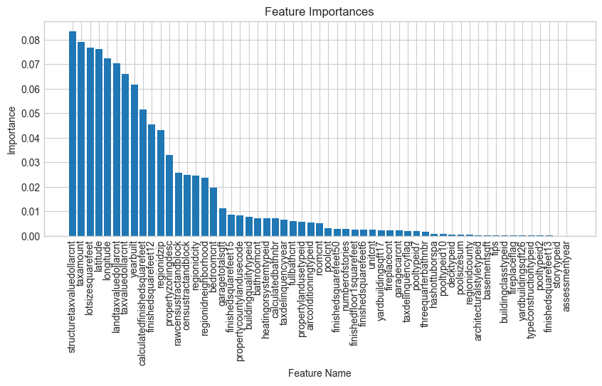

Proportion of Transactions in Each Month

        transaction_month  month
    1            0.072623      1
    2            0.070152      2
    3            0.095840      3
    4            0.103140      4
    5            0.110341      5
    6            0.120986      6
    7            0.110186      7
    8            0.116045      8
    9            0.106065      9
    10           0.055132     10
    11           0.020227     11
    12           0.019263     12

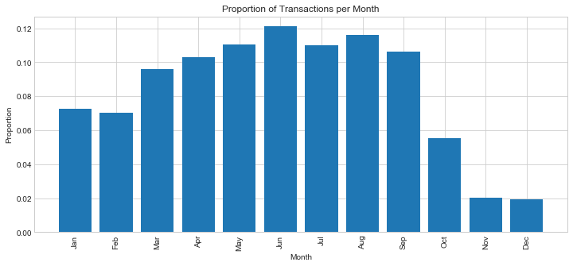

Feature Importance

       parcelid  logerror transactiondate  transaction_month  \
    0  11016594    0.0276      2016-01-01                  1   
    1  12379107    0.0276      2016-01-22                  1   
    2  12259947    0.0010      2016-01-22                  1   
    3  17204079    0.0871      2016-01-22                  1   
    4  12492292   -0.0212      2016-01-22                  1   
    
       airconditioningtypeid  architecturalstyletypeid  basementsqft  bathroomcnt  \
    0                    1.0                      -1.0          -1.0          2.0   
    1                   -1.0                      -1.0          -1.0          1.0   
    2                   -1.0                      -1.0          -1.0          1.0   
    3                   -1.0                      -1.0          -1.0          4.0   
    4                    1.0                      -1.0          -1.0          1.0   
    
       bedroomcnt  buildingclasstypeid         ...           numberofstories  \
    0         3.0                 -1.0         ...                      -1.0   
    1         2.0                 -1.0         ...                      -1.0   
    2         3.0                 -1.0         ...                      -1.0   
    3         4.0                 -1.0         ...                       2.0   
    4         3.0                 -1.0         ...                      -1.0   
    
       fireplaceflag  structuretaxvaluedollarcnt  taxvaluedollarcnt  \
    0             -1                    122754.0           360170.0   
    1             -1                     37095.0           185481.0   
    2             -1                    137012.0           240371.0   
    3             -1                    373100.0           746200.0   
    4             -1                     40729.0            61709.0   
    
       assessmentyear  landtaxvaluedollarcnt  taxamount  taxdelinquencyflag  \
    0          2015.0               237416.0    6735.88                  -1   
    1          2015.0               148386.0    3051.73                  -1   
    2          2015.0               103359.0    5707.91                  -1   
    3          2015.0               373100.0    8576.10                  -1   
    4          2015.0                20980.0    1056.92                  -1   
    
       taxdelinquencyyear  censustractandblock  
    0                -1.0         6.037107e+13  
    1                -1.0         6.037532e+13  
    2                -1.0         6.037541e+13  
    3                -1.0         6.111008e+13  
    4                -1.0         6.037571e+13  
    
    [5 rows x 61 columns]
    ---------------------
    (90275, 61)

       transaction_month  airconditioningtypeid  architecturalstyletypeid  \
    0                  1                    1.0                      -1.0   
    1                  1                   -1.0                      -1.0   
    2                  1                   -1.0                      -1.0   
    3                  1                   -1.0                      -1.0   
    4                  1                    1.0                      -1.0   
    
       basementsqft  bathroomcnt  bedroomcnt  buildingclasstypeid  \
    0          -1.0          2.0         3.0                 -1.0   
    1          -1.0          1.0         2.0                 -1.0   
    2          -1.0          1.0         3.0                 -1.0   
    3          -1.0          4.0         4.0                 -1.0   
    4          -1.0          1.0         3.0                 -1.0   
    
       buildingqualitytypeid  calculatedbathnbr  decktypeid         ...           \
    0                    4.0                2.0        -1.0         ...            
    1                    7.0                1.0        -1.0         ...            
    2                    7.0                1.0        -1.0         ...            
    3                   -1.0                4.0        -1.0         ...            
    4                    7.0                1.0        -1.0         ...            
    
       numberofstories  fireplaceflag  structuretaxvaluedollarcnt  \
    0             -1.0              0                    122754.0   
    1             -1.0              0                     37095.0   
    2             -1.0              0                    137012.0   
    3              2.0              0                    373100.0   
    4             -1.0              0                     40729.0   
    
       taxvaluedollarcnt  assessmentyear  landtaxvaluedollarcnt  taxamount  \
    0           360170.0          2015.0               237416.0    6735.88   
    1           185481.0          2015.0               148386.0    3051.73   
    2           240371.0          2015.0               103359.0    5707.91   
    3           746200.0          2015.0               373100.0    8576.10   
    4            61709.0          2015.0                20980.0    1056.92   
    
       taxdelinquencyflag  taxdelinquencyyear  censustractandblock  
    0                   0                -1.0         6.037107e+13  
    1                   0                -1.0         6.037532e+13  
    2                   0                -1.0         6.037541e+13  
    3                   0                -1.0         6.111008e+13  
    4                   0                -1.0         6.037571e+13  
    
    [5 rows x 58 columns]
    ------------
    0    0.0276
    1    0.0276
    2    0.0010
    3    0.0871
    4   -0.0212
    Name: logerror, dtype: float64

                       features  importance
    0         transaction_month    0.041821
    1     airconditioningtypeid    0.005177
    2  architecturalstyletypeid    0.000454
    3              basementsqft    0.000240
    4               bathroomcnt    0.006978

    ------------
                          features  importance
    50  structuretaxvaluedollarcnt    0.077436
    54                   taxamount    0.075280
    26           lotsizesquarefeet    0.074077
    24                    latitude    0.071933
    25                   longitude    0.069367

Here we see that the greatest importance in predicting the log-error comes from features involving taxes and geographical location of the property. Notably, the 'transaction_month' feature that was engineered earlier was the 12th most important feature. 

    ---------------------------------------------------------------------------

    NameError                                 Traceback (most recent call last)

    <ipython-input-64-1e807e847848> in <module>()
    ----> 1 test= test.rename(columns={'ParcelId': 'parcelid'})
          2 #To make it easier for merging datasets on same column_id later

    NameError: name 'test' is not defined

## Conclusions

In Progress

## Bibliography

Couzin-Frankel, J. 2010. “Cancer Research. As Questions Grow, Duke Halts Trials, Launches Investigation.” Science 329 (5992): 614–15. 

Hunter, J. D. 2007. “Matplotlib: A 2D Graphics Environment.” Computing In Science & Engineering 9 (3): 90–95.

McKinney, W. 2010. “Data Structures for Statistical Computing in Python.” In Proceedings of the 9th Python in Science Conference, edited by S. J. van der Walt and K. J. Millman. Austin, Texas.

Pedregosa, Fabian, Gaël Varoquaux, Alexandre Gramfort, Vincent Michel, Bertrand Thirion, Olivier Grisel, Mathieu Blondel, et al. 2011. “Scikit-Learn: Machine Learning in Python.” Journal of Machine Learning Research 12 (Oct): 2825–30.

Pérez, F., and B. E. Granger. 2007. “IPython: A System for Interactive Scientific Computing.” Computing in Science & Engineering 9 (3): 21–29.

Pérez, F., B. E. Granger, and J. D. Hunter. 2011. “Python: An Ecosystem for Scientific Computing.” Computing in Science & Engineering 13 (2): 13–21.

Van der Walt, S., S. C. Colbert, and G. Varoquaux. 2011. “The NumPy Array: A Structure for Efficient Numerical Computation.” Computing in Science & Engineering 13 (2): 22–30.

Waskom, M, O Botvinnik, P Hobson, J Warmenhoven, JB Cole, Y Halchenko, J Vanderplas, et al. 2014. Seaborn: Statistical Data Visualization. Stanford, California.

