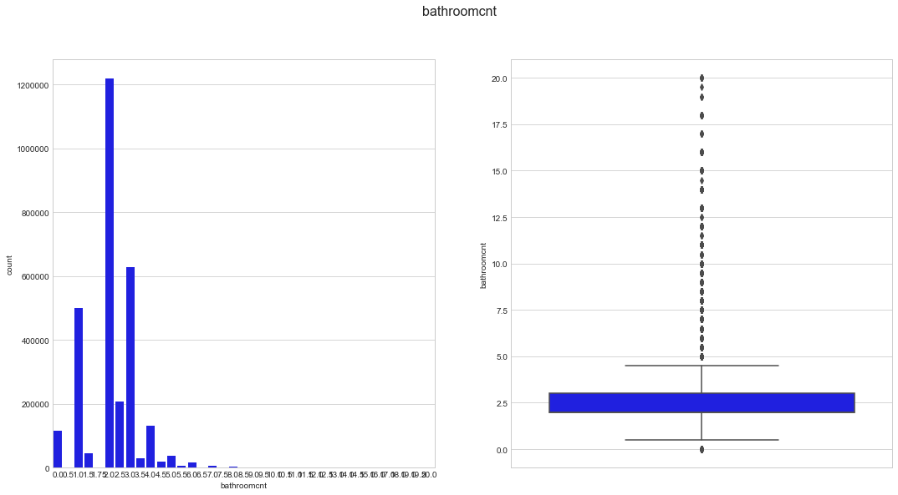
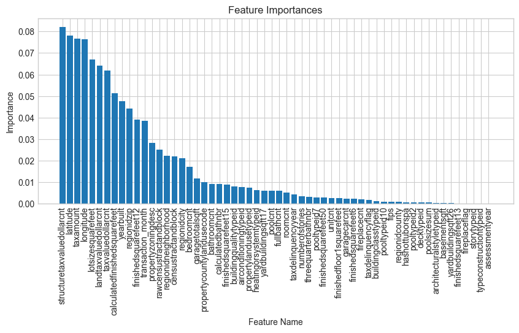
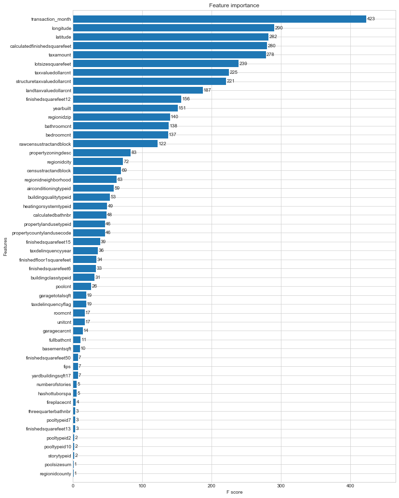

# Zillow prize data analysis report

## Introduction

The [Zillow Prize](https://www.zillow.com/promo/Zillow-prize/) is a [Kaggle competition](https://www.kaggle.com/c/zillow-prize-1) that aims to inspire data scientists around the world to improve the accuracy of the Zillow "Zestimate" statistical and machine learning models. 

My goal is to compete for the Zillow prize and write up my results.

## Methods

### Data

The data were obtained from [Kaggle website](https://www.kaggle.com/c/zillow-prize-1/data) and consist of the following files:
- `properties_2016.csv.zip`
- `properties_2017.csv.zip`
- `sample_submission.csv`
- `train_2016_v2.csv.zip`
- `train_2017.csv.zip`
- `zillow_data_dictionary.xlsx` 
The `zillow_data_dictionary.xlsx` is a code book that explains the data.
This data will be made available on [figshare](https://figshare.com/) to provide an additional source if the [Kaggle site data](https://www.kaggle.com/c/zillow-prize-1/data) become unavailable.

### Analysis

Data analysis was done in Jupyter Notebook (Pérez and Granger 2007)<cite data-cite="5251998/SH25XT8L"></cite> Integrated Development Environment using the Python language (Pérez, Granger, and Hunter 2011)<cite data-cite="5251998/FGTD82L2"></cite> and a number of software packages:

- NumPy (van der Walt, Colbert, and Varoquaux 2011)<cite data-cite="5251998/3SWILWGR"></cite>

- pandas (McKinney 2010)<cite data-cite="5251998/K3NZPGU9"></cite>

- scikit-learn (Pedregosa et al. 2011)<cite data-cite="5251998/SBYLEUVD"></cite>

### Visualization

The following packages were used to visualize the data:

- Matplotlib (Hunter 2007)<cite data-cite="5251998/WP5LZ6AZ"></cite>

- Seaborn (Waskom et al. 2014)<cite data-cite="5251998/NSFX6VMN"></cite>

- r-ggplot2

- r-cowplot

The use of `R` code and packages in a `Python` environment is possible through the use of the `Rpy2` package.

### Prediction

Machine learning prediction was done using the following packages:

- scikit-learn (Pedregosa et al. 2011)<cite data-cite="5251998/SBYLEUVD"></cite>
- xgboost
- r-caret 

### Reproducibility

Reproducibility is extremely important in scientific research yet many examples of problematic studies exist in the literature (Couzin-Frankel 2010)<cite data-cite="5251998/UXR4ZTUS"></cite>.

The names and versions of each package used herein are listed in the accompanying `env.yml` file in the `config` folder.
The computational environment used to analyze the data can be recreated using this `env.yml` file and the [`conda` package and environment manager](https://conda.io/docs/using/envs.html) available as part of the [Anaconda distribution of Python](https://www.anaconda.com/download/).

Additionally, details on how to setup a Docker image capable of running the analysis is included in the `README.md` file in the `config` folder.

The code in the form of a jupyter notebook (`01_zillow_MWS.ipynb`) or Python script (`01_zillow_MWS.py`), can also be run on the Kaggle website (this requires logging in with a username and password).

More information on the details of how this project was created and the computational environment was configured can be found in the accompanying `README.md` file.

This Python 3 environment comes with many helpful analytics libraries installed
It is defined by the kaggle/python docker image: https://github.com/kaggle/docker-python (a modified version of this docker image will be made available as part of my project to ensure reproducibility).
For example, here's several helpful packages to load in 

## Results

### Import Libraries and Data

Input data files are available in the "../input/" directory.

Any results I write to the current directory are saved as output.

    /Users/marskar/anaconda3/lib/python3.6/site-packages/IPython/core/interactiveshell.py:2728: DtypeWarning: Columns (22,32,34,49,55) have mixed types. Specify dtype option on import or set low_memory=False.
      interactivity=interactivity, compiler=compiler, result=result)

    (2985217, 58)

    parcelid                         0.000000
    airconditioningtypeid           72.815410
    architecturalstyletypeid        99.796966
    basementsqft                    99.945465
    bathroomcnt                      0.383959
    bedroomcnt                       0.383557
    buildingclasstypeid             99.576949
    buildingqualitytypeid           35.063749
    calculatedbathnbr                4.318346
    decktypeid                      99.427311
    finishedfloor1squarefeet        93.209304
    calculatedfinishedsquarefeet     1.861339
    finishedsquarefeet12             9.246664
    finishedsquarefeet13            99.743000
    finishedsquarefeet15            93.608572
    finishedsquarefeet50            93.209304
    finishedsquarefeet6             99.263002
    fips                             0.383121
    fireplacecnt                    89.527160
    fullbathcnt                      4.318346
    garagecarcnt                    70.411967
    garagetotalsqft                 70.411967
    hashottuborspa                  97.688141
    heatingorsystemtypeid           39.488453
    latitude                         0.383121
    longitude                        0.383121
    lotsizesquarefeet                9.248875
    poolcnt                         82.663438
    poolsizesum                     99.063385
    pooltypeid10                    98.762603
    pooltypeid2                     98.925539
    pooltypeid7                     83.737899
    propertycountylandusecode        0.411260
    propertylandusetypeid            0.383121
    propertyzoningdesc              33.719090
    rawcensustractandblock           0.383121
    regionidcity                     2.105207
    regionidcounty                   0.383121
    regionidneighborhood            61.262381
    regionidzip                      0.468308
    roomcnt                          0.384394
    storytypeid                     99.945599
    threequarterbathnbr             89.560859
    typeconstructiontypeid          99.773986
    unitcnt                         33.757244
    yardbuildingsqft17              97.308236
    yardbuildingsqft26              99.911330
    yearbuilt                        2.007492
    numberofstories                 77.151778
    fireplaceflag                   99.827048
    structuretaxvaluedollarcnt       1.841809
    taxvaluedollarcnt                1.425357
    assessmentyear                   0.383188
    landtaxvaluedollarcnt            2.268947
    taxamount                        1.046825
    taxdelinquencyflag              98.108613
    taxdelinquencyyear              98.108546
    censustractandblock              2.516601
    dtype: float64

There are several columns which have a very high proportion of missing values. It may be worth analysing these more closely.

#### Feature Importance by Random Forest

    (90275, 3)

For submission we are required to predict values for October, November and December. The differing distributions of the target variable over these months indicates that it may be useful to create an additional 'transaction_month' feature as shown above. Lets have a closer look at the distribution across only October, November and December.

Proportion of Transactions in Each Month

Feature Importance

                       features  importance
    0         transaction_month    0.038390
    1     airconditioningtypeid    0.007597
    2  architecturalstyletypeid    0.000201
    3              basementsqft    0.000161
    4               bathroomcnt    0.009147

    ------------
                          features  importance
    50  structuretaxvaluedollarcnt    0.082022
    24                    latitude    0.078202
    54                   taxamount    0.076560
    25                   longitude    0.076341
    26           lotsizesquarefeet    0.066890

Here we see that the greatest importance in predicting the log-error comes from features involving taxes and geographical location of the property. Notably, the 'transaction_month' feature that was engineered earlier was the 12th most important feature. 

## Conclusions

In Progress

## Bibliography

Couzin-Frankel, J. 2010. “Cancer Research. As Questions Grow, Duke Halts Trials, Launches Investigation.” Science 329 (5992): 614–15. 

Hunter, J. D. 2007. “Matplotlib: A 2D Graphics Environment.” Computing In Science & Engineering 9 (3): 90–95.

McKinney, W. 2010. “Data Structures for Statistical Computing in Python.” In Proceedings of the 9th Python in Science Conference, edited by S. J. van der Walt and K. J. Millman. Austin, Texas.

Pedregosa, Fabian, Gaël Varoquaux, Alexandre Gramfort, Vincent Michel, Bertrand Thirion, Olivier Grisel, Mathieu Blondel, et al. 2011. “Scikit-Learn: Machine Learning in Python.” Journal of Machine Learning Research 12 (Oct): 2825–30.

Pérez, F., and B. E. Granger. 2007. “IPython: A System for Interactive Scientific Computing.” Computing in Science & Engineering 9 (3): 21–29.

Pérez, F., B. E. Granger, and J. D. Hunter. 2011. “Python: An Ecosystem for Scientific Computing.” Computing in Science & Engineering 13 (2): 13–21.

Van der Walt, S., S. C. Colbert, and G. Varoquaux. 2011. “The NumPy Array: A Structure for Efficient Numerical Computation.” Computing in Science & Engineering 13 (2): 22–30.

Waskom, M, O Botvinnik, P Hobson, J Warmenhoven, JB Cole, Y Halchenko, J Vanderplas, et al. 2014. Seaborn: Statistical Data Visualization. Stanford, California.

